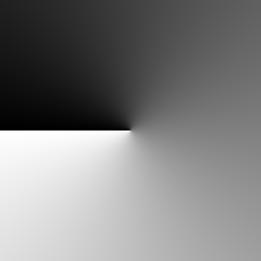
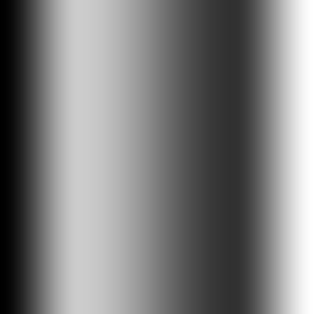
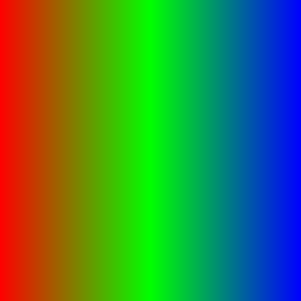

# Day 02: Gradient

## Overview

Gradients are among the most fundamental building blocks in shader programming. This shader explores how gradients work by decomposing them into three independent axes: **Shape** (how to generate a base value from UV), **Interpolation** (how to transform that value), and **Color Mapping** (how to convert the result into a final color).

## Architecture: Three-Axis System

```
Shape         →  t  (0~1 scalar from UV)
Interpolation →  f  (transformed 0~1 scalar)
Color Mapping →  final color
```

Each axis is an independent choice, allowing any combination (e.g., Radial + Smoothstep + MultiStop) without code duplication.

---

## Axis 1: Shape

Shape determines how a 0–1 scalar `t` is extracted from UV coordinates.

### Linear

- `t = UV.x`
- Horizontal gradient from left (0) to right (1)

### Radial

- `t = clamp(distance(UV, center) * 2.0, 0.0, 1.0)`
- Circular gradient emanating from center
- Normalized by multiplying by 2.0 so that `t` reaches 1.0 at the nearest edge

### Angular

- `t = (atan(dir.y, dir.x) + PI) / TAU`
- Sweeps 0→1 around a full circle
- `atan()` returns −π to π, shifted and scaled to 0–1

---

## Axis 2: Interpolation

Interpolation transforms `t` into `f`, reshaping the gradient's transition curve.

### Raw
- `f = t` — No transformation, linear falloff

### Smoothstep

- `f = smoothstep(edge0, edge1, t)`
- S-curve transition between two edges
- Parameters: `edge0` (start), `edge1` (end)

### Step

- `f = step(threshold, t)`
- Hard binary cut at threshold — 0 below, 1 above
- Creates sharp boundaries with no transition
- Parameter: `threshold`

### Custom (CurveTexture)

- `f = texture(custom_curve, vec2(t, 0.0)).r`
- User-defined curve baked into a 1D texture
- Godot's `CurveTexture` provides a visual curve editor

---

## Axis 3: Color Mapping

Color Mapping converts the interpolated scalar `f` into a final color.

### TwoColor
- `mix(color_a, color_b, f)`
- Simple blend between two colors
- Parameters: `color_a`, `color_b`

### MultiStop

- Blends across an array of up to 8 color stops
- `f` is scaled to the number of segments, then `mix()` is applied within each segment
- Parameters: `color_count`, `stop_colors[]`

---

## Key Concepts

### 1. `mix()` — Linear Interpolation
```gdshader
mix(a, b, t)  // returns a * (1.0 - t) + b * t
```
The foundation of all gradient blending. When `t` is 0 the result is `a`, when 1 the result is `b`.

### 2. `smoothstep()` — Smooth Transition
```gdshader
smoothstep(edge0, edge1, t)  // Hermite interpolation with S-curve
```
Returns 0 below `edge0`, 1 above `edge1`, and a smooth curve in between. Widely used for soft edges.

### 3. `step()` — Hard Threshold
```gdshader
step(threshold, t)  // returns 0.0 if t < threshold, else 1.0
```
Binary cutoff with no transition. Essential for masks and hard boundaries.

### 4. `distance()` and `atan()` — UV Space Calculations
```gdshader
distance(UV, vec2(0.5))           // Euclidean distance from center
atan(dir.y, dir.x)                // Angle in radians (-PI to PI)
```
These transform 2D UV coordinates into 1D scalars, enabling radial and angular patterns.

### 5. CurveTexture as Custom Function
```gdshader
texture(custom_curve, vec2(t, 0.0)).r  // Sample curve at position t
```
Since shaders cannot accept function pointers, a `CurveTexture` serves as a user-defined remapping function baked into a 1D texture.

---

## Usage

1. Open `gradient.tscn` in Godot
2. Select the root node
3. In the Inspector, adjust:
   - **Shape**: Choose gradient geometry (Linear / Radial / Angular)
   - **Interpolation**: Choose transition curve (Raw / Smoothstep / Step / Custom)
   - **Color Mapping**: Choose color mode (TwoColor / MultiStop)
4. Parameters relevant to the selected mode appear automatically

## Files

- `gradient.gdshader` — The shader implementation
- `gradient.tscn` — Test scene
- `Gradient.cs` — C# wrapper exposing shader parameters to the Inspector
- `README.md` — This documentation
