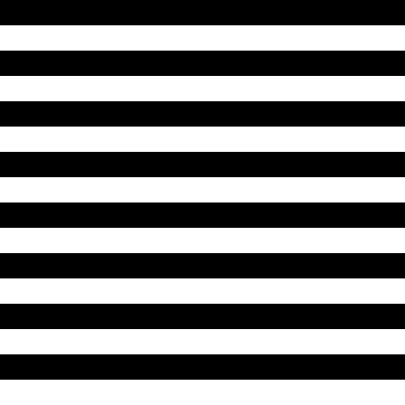
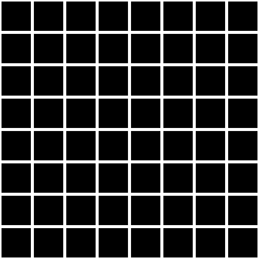

# Day 03: Stripes & Checkerboard Patterns

## Overview

Day 03 focuses on **discrete repeating patterns**. By combining `fract()`, `floor()`, and `step()`, we transform smooth UV coordinates into structured, repeating patterns. These techniques are foundational for procedural textures, tilesets, and game UI.

```
Pattern Mode  →  pattern_value (0 or 1)  →  mix(color_a, color_b)
```

Each mode generates a binary value, which is then mapped to two colors.

---

## Pattern Modes

### Stripes

- Repeating bands along a chosen axis
- `step(duty_cycle, fract(coord * frequency))`
- `fract()` creates repeating 0–1 intervals, `step()` binarizes them

**Parameters:**
- `frequency` — Number of repetitions
- `direction` — Horizontal (`UV.y`) / Vertical (`UV.x`) / Diagonal (`(UV.x + UV.y) * 0.5`)
- `duty_cycle` — Ratio of color_a within each period (0.0–1.0)

### Checkerboard

- Alternating cells using index parity
- `mod(floor(UV.x * frequency) + floor(UV.y * frequency), 2.0)`
- `floor()` extracts integer cell indices; summing X and Y indices and taking mod 2 ensures adjacent cells always alternate

**Parameters:**
- `frequency` — Grid density

### Grid

- Lines drawn at cell boundaries
- `fract()` produces cell-local coordinates (0–1), then `step()` tests proximity to edges

```gdshader
vec2 cell = fract(UV * frequency);
float line_x = step(cell.x, line_thickness * 0.5)
             + step(1.0 - line_thickness * 0.5, cell.x);
float line_y = step(cell.y, line_thickness * 0.5)
             + step(1.0 - line_thickness * 0.5, cell.y);
```

**Parameters:**
- `frequency` — Grid density
- `line_thickness` — Line width relative to cell size

### Dots

- Circles at each cell center
- `fract()` for cell-local coordinates, `distance()` from center, `step()` for cutoff

```gdshader
vec2 cell = fract(UV * frequency);
float dist = distance(cell, vec2(0.5));
pattern_value = step(dist, dot_radius);
```

**Parameters:**
- `frequency` — Grid density
- `dot_radius` — Circle radius relative to cell size (0.0–0.5)

---

## Key Concepts

### 1. `fract()` — Repeating Intervals
```gdshader
fract(UV.x * 8.0)  // 0→1 repeated 8 times across the surface
```
Returns the fractional part of a value, creating repeating 0–1 intervals. First seen in Day 01 (Tiling mode), now used as the core pattern-building tool.

### 2. `floor()` — Cell Index Extraction
```gdshader
floor(UV.x * 8.0)  // Returns 0, 1, 2, ..., 7 as integer cell indices
```
Converts continuous UV into discrete cell indices. Essential for patterns that depend on which cell a pixel belongs to.

### 3. `mod()` — Modular Arithmetic
```gdshader
mod(cx + cy, 2.0)  // Alternates between 0.0 and 1.0
```
When applied to integer values from `floor()`, produces cyclic patterns. With mod 2, creates binary alternation for checkerboard patterns.

---

## Usage

1. Open `stripe_checkerboard.tscn` in Godot
2. Select the root node
3. In the Inspector, adjust:
    - **Pattern**: Choose pattern type (Stripes / Checkerboard / Grid / Dots)
    - Parameters relevant to the selected mode appear automatically
    - **Color A / Color B**: Set the two alternating colors

## Files

- `stripe_checkerboard.gdshader` — The shader implementation
- `stripe_checkerboard.tscn` — Test scene
- `StripeCheckerboard.cs` — C# wrapper exposing shader parameters to the Inspector
- `README.md` — This documentation
- 