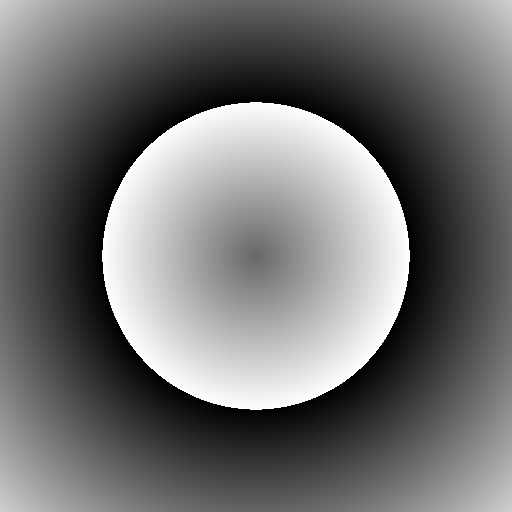
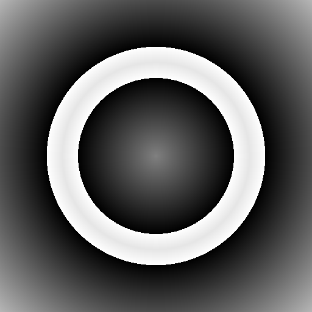
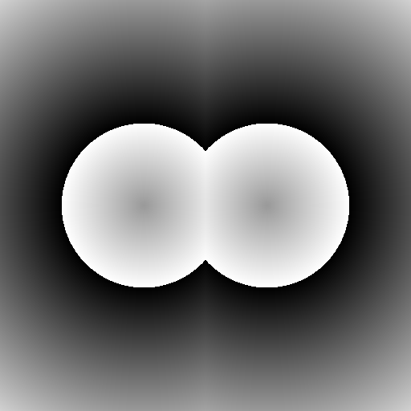
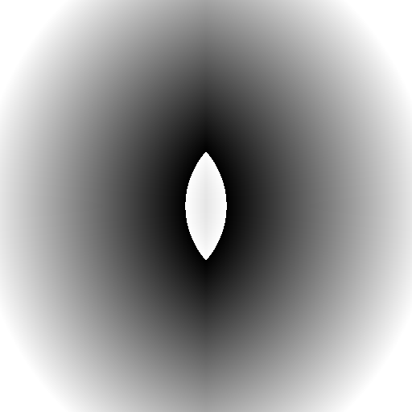
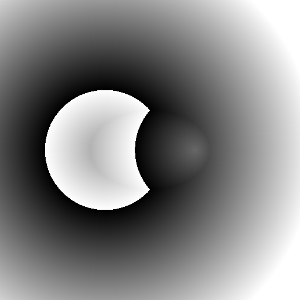
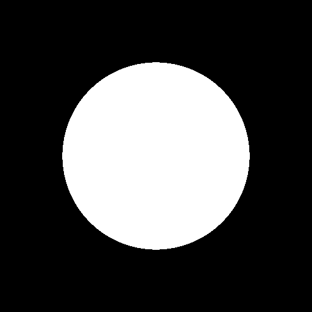
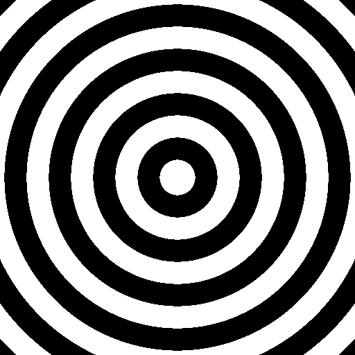

# Day 04: Circle & Shapes (SDF Intro)

## Overview

A Signed Distance Function (SDF) returns the shortest distance from a point to a shape's boundary, with a sign: **negative** inside, **positive** outside, and **zero** on the boundary. This single float value can define any shape, and simple math operations on SDF values can combine shapes in powerful ways.

```
Shape A  →  sdf_a (signed distance)
Shape B  →  sdf_b (signed distance)
Operation  →  combined sdf
Visualization  →  final color
```

---

## SDF Shapes

### Circle

- `length(p) - radius`
- The simplest SDF. Distance from center minus radius: negative inside, positive outside.

### Rectangle

- Uses `abs(p) - size` to compute per-axis distances to the box boundary
- `length(max(d, 0.0))` handles exterior distance (Euclidean near corners)
- `min(max(d.x, d.y), 0.0)` handles interior distance

### Rounded Rectangle

- `sdf_rectangle(p, size - corner_radius) - corner_radius`
- Shrinks the box inward, then expands the distance field outward by the corner radius
- This "inflation" technique is a common SDF trick for rounding any shape

### Ring

- `abs(sdf_circle(p, radius)) - thickness`
- Takes the absolute value of a circle's SDF, turning the zero-crossing into a band
- Subtracting thickness widens that band into a ring

---

## SDF Operations

SDF operations combine two distance fields using simple math. This is one of SDF's most powerful properties.

### Union

- `min(sdf_a, sdf_b)`
- Takes the closer boundary — if either shape contains the point, the result is inside

### Intersection

- `max(sdf_a, sdf_b)`
- Takes the farther boundary — the point must be inside both shapes

### Subtraction

- `max(sdf_a, -sdf_b)`
- Negating `sdf_b` flips its inside/outside. Combined with `max`, only the region inside A but outside B remains

---

## Visualization Modes

Three ways to view the SDF, each revealing different information.

### Solid

- `sdf < 0.0 ? shape_color : background_color`
- Binary rendering: inside or outside. Shows the final shape.

### Distance

- Maps `abs(sdf)` to color intensity, with different hues for inside vs outside
- Reveals how the distance field is distributed in space

### Stepped

- `abs(floor(sdf * band_frequency))` with `mod(..., 2.0)` for alternating bands
- Contour lines at regular distance intervals, like a topographic map
- Same `fract()`/`floor()` + `mod()` pattern from Day 03, applied in 1D to the distance field

---

## Key Concepts

### 1. Signed Distance
```gdshader
float sdf = length(p) - radius;
// sdf < 0  → inside
// sdf == 0 → on boundary
// sdf > 0  → outside
```
A single float encodes both membership (sign) and proximity (magnitude).

### 2. Rectangle SDF
```gdshader
vec2 d = abs(p) - size;
length(max(d, 0.0)) + min(max(d.x, d.y), 0.0);
```
`abs(p)` exploits symmetry to reduce four quadrants to one. The two terms handle exterior and interior distances separately.

### 3. Shape Inflation
```gdshader
sdf_rectangle(p, size - vec2(r)) - r;   // Rounded rectangle
abs(sdf_circle(p, radius)) - thickness; // Ring
```
Subtracting a constant from an SDF "inflates" the shape outward by that amount. This technique turns sharp corners into rounded ones and thin boundaries into thick bands.

### 4. Boolean Operations via min/max
```gdshader
min(a, b)       // Union: closer boundary wins
max(a, b)       // Intersection: farther boundary wins
max(a, -b)      // Subtraction: flip B, then intersect
```
Because SDF values represent distances, set operations reduce to simple comparisons.

---

## Usage

1. Open `sdf_intro.tscn` in Godot
2. Select the root node
3. In the Inspector, adjust:
   - **Shape A / Shape B**: Choose shape types (Circle / Rectangle / RoundedRect / Ring / None)
   - **Operation**: Choose how shapes combine (Union / Intersection / Subtraction)
   - **Visualization**: Choose rendering mode (Solid / Distance / Stepped)

## Files

- `sdf_intro.gdshader` — The shader implementation
- `sdf_intro.tscn` — Test scene
- `SdfIntro.cs` — C# wrapper exposing shader parameters to the Inspector
- `README.md` — This documentation
