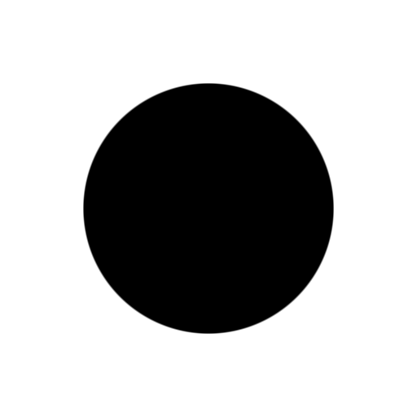
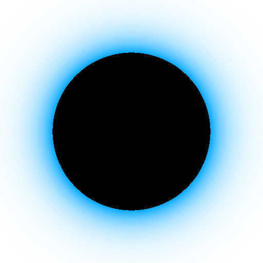
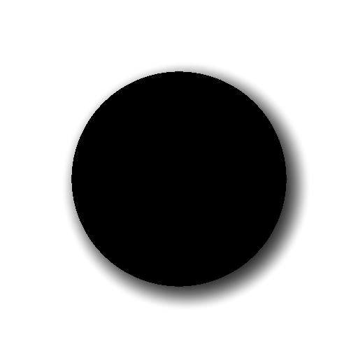

# Day 05: Soft Shapes & Anti-aliasing

## Overview

Day 04 rendered SDF shapes with hard binary edges (`sdf < 0.0`), resulting in jagged pixel boundaries. Day 05 explores techniques to soften those edges and add visual effects using the same SDF value. The key insight: since SDF gives us a continuous distance to the boundary, we can control exactly how that boundary transitions from inside to outside.

---

## Edge Modes

All three modes produce a `mask` value (0–1) from the SDF, controlling the shape's opacity.

### Hard Edge

- `step(0.0, -sdf)`
- Binary: 1 inside, 0 outside. No transition.
- Included as a baseline for comparison.

### Soft Edge

- `smoothstep(softness, -softness, sdf)`
- Symmetric transition centered on the boundary, total width = `2 × softness`
- `softness` parameter gives direct control over the blur width

**Parameter:**
- `softness` — Half-width of the transition zone (0.0–0.2)

### Auto AA

- `smoothstep(fwidth(sdf), -fwidth(sdf), sdf)`
- `fwidth()` returns the screen-space rate of change of the SDF value
- Automatically adapts to resolution — always produces a ~1 pixel smooth edge
- The standard shader anti-aliasing technique

---

## Effects

Independent toggles that layer on top of the edge mode.

### Glow

- `exp(-sdf * glow_falloff)`
- Exponential decay from the boundary outward
- SDF naturally provides "distance from boundary", making glow trivial to implement

**Parameters:**
- `glow_falloff` — Decay rate (0.0–32.0). Higher = tighter glow
- `glow_color` — Color of the glow effect

### Shadow

- Recalculates the circle SDF at an offset position
- `smoothstep(shadow_softness, -shadow_softness, shadow_sdf)`
- Same symmetric blur as Soft Edge, applied to the offset shape

**Parameters:**
- `shadow_offset` — Direction and distance of shadow
- `shadow_softness` — Blur amount of shadow edge
- `shadow_color` — Color and opacity of shadow

---

## Compositing Order

Effects are layered back-to-front using `mix()`:

```
1. Start with background_color
2. Shadow    →  mix(color, shadow_color, shadow_mask)
3. Glow      →  mix(color, glow_color, glow)
4. Shape     →  mix(color, shape_color, mask)
```

Each `mix()` blends the new layer over the previous result, with the mask controlling opacity.

---

## Key Concepts

### 1. `smoothstep()` for Soft Edges
```gdshader
smoothstep(softness, -softness, sdf)
```
When the two edges straddle zero symmetrically, the transition is centered on the boundary. The shape's perceptual size is preserved because the blur extends equally inward and outward.

### 2. `fwidth()` for Resolution-Independent AA
```gdshader
float pixel_size = fwidth(sdf);
smoothstep(pixel_size, -pixel_size, sdf);
```
`fwidth(x)` returns `abs(dFdx(x)) + abs(dFdy(x))` — the total screen-space variation of `x` across the current pixel. Using this as the smoothstep width ensures the transition is always exactly one pixel wide, regardless of zoom level or resolution.

### 3. Exponential Decay for Glow
```gdshader
exp(-sdf * falloff)
```
At the boundary (sdf = 0), the value is 1. It falls off exponentially with distance. This produces a natural, physically-inspired light falloff without hard cutoffs.

### 4. Back-to-Front Compositing
```gdshader
color = mix(color, layer_color, layer_mask);
```
Sequential `mix()` calls with mask values implement painter's algorithm layering. Each layer's mask determines how much it covers the layers beneath.

---

## Usage

1. Open `anti_aliasing.tscn` in Godot
2. Select the root node
3. In the Inspector, adjust:
    - **Edge Mode**: Choose boundary rendering (Hard / Soft / Auto AA)
    - **Glow Enabled / Shadow Enabled**: Toggle effects independently

## Files

- `anti_aliasing.gdshader` — The shader implementation
- `anti_aliasing.tscn` — Test scene
- `AntiAliasing.cs` — C# wrapper exposing shader parameters to the Inspector
- `README.md` — This documentation