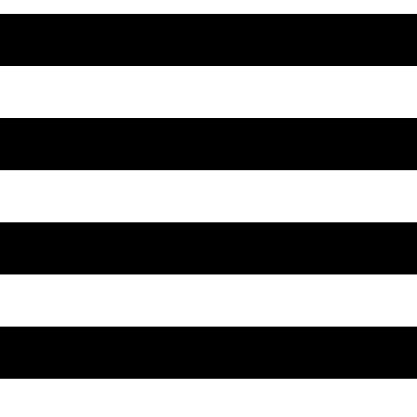
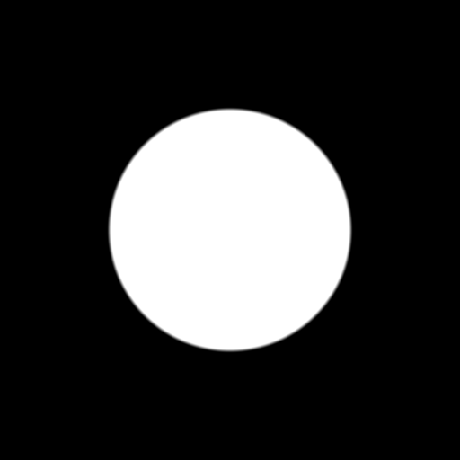
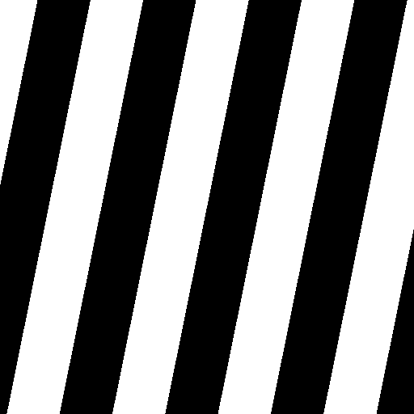
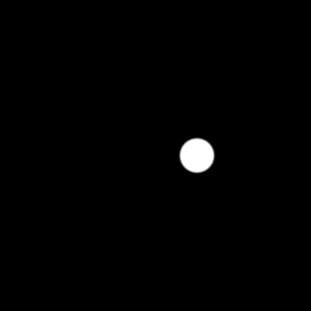

# Day 06: Animation Basics

## Overview

Day 06 introduces the `TIME` built-in variable to bring motion. Each animation mode demonstrates a different way to use `TIME`, and the Ping Pong mode adds a transition/easing system.

`TIME` is a float that counts seconds since the shader started running. By combining it with the functions already learned — `fract()`, `sin()`, `step()`, `smoothstep()`, `mat2` rotation — everything starts to move.

---

## Animation Modes

### Scrolling

- `step(0.5, fract((UV.y + TIME * speed) * 4.0))`
- Adds `TIME` to UV before pattern generation, causing stripes to flow

### Pulsing Circle

- `length(uv) - radius * (1.0 + 0.3 * sin(TIME * speed))`
- `sin(TIME)` oscillates -1 to 1, modulating the circle's radius

### Rotation

- Applies a 2D rotation matrix to UV before pattern generation
- `mat2(vec2(cos(θ), sin(θ)), vec2(-sin(θ), cos(θ)))` where `θ = TIME * speed`
- The rotation matrix transforms each UV coordinate to its rotated position

### Color Cycle

- `0.5 + 0.5 * cos(TIME * speed + uv.xyx + vec3(0.0, 2.094, 4.189))`
- Cosine palette technique: RGB channels offset by 120° (2π/3) cycle through the spectrum

### Ping Pong

- A circle moves back and forth horizontally, visualizing the easing curve as physical motion
- Combines a triangle wave with configurable transition and easing

---

## Transition & Easing System (Ping Pong)

Animation curves are decomposed into two independent axes:

### Transition — Curve Shape

Defines the mathematical function applied. All transitions are defined in their EaseIn form:

- **Linear** — `t` (constant speed, no curve)
- **Quadratic** — `t²` (gentle acceleration)
- **Cubic** — `t³` (stronger acceleration)
- **Sine** — `1.0 - cos(t × π/2)` (sinusoidal acceleration)
- **Back** — `t²(2.70158t - 1.70158)` (overshoots then returns)

### Easing — Curve Direction

Determines how the transition function is applied:

- **EaseIn** — `transition(t)` — Slow start, fast end
- **EaseOut** — `1 - transition(1 - t)` — Fast start, slow end
- **EaseInOut** — EaseIn for first half, EaseOut for second half — Slow on both ends
- **EaseOutIn** — EaseOut for first half, EaseIn for second half — Fast on both ends

Easing wraps the transition function rather than being applied sequentially. For example, EaseOut reverses the input, applies the transition, then reverses the output. EaseInOut splits the time range and applies EaseIn and EaseOut to each half.

---

## Key Concepts

### 1. `TIME` — The Animation Clock
```gdshader
TIME  // Seconds elapsed since shader start (float)
```
Combined with math functions, `TIME` drives all procedural animation. Adding it to UV creates scrolling, multiplying by frequency controls speed, and feeding it to `sin()` creates oscillation.

### 2. Triangle Wave — Ping Pong Motion
```gdshader
float triangle = abs(fract(t) * 2.0 - 1.0);
```
`fract()` creates a sawtooth (0→1 repeating), `* 2.0 - 1.0` shifts to -1→1, and `abs()` folds it into 0→1→0. One of four fundamental waveforms alongside sine (`sin`), square (`step`), and sawtooth (`fract`).

### 3. 2D Rotation Matrix
```gdshader
mat2(vec2(cos(θ), sin(θ)), vec2(-sin(θ), cos(θ)))
```
Rotates a 2D vector by angle θ around the origin. Applied to UV coordinates before pattern generation, making any pattern rotate. Requires centered UV (`UV - 0.5`).

### 4. Cosine Palette
```gdshader
vec3 color = 0.5 + 0.5 * cos(t + vec3(0.0, 2.094, 4.189));
```
RGB channels driven by `cos()` with 120° phase offsets cycle through the full spectrum. A classic technique for procedural color generation without predefined palettes.

### 5. Transition × Easing Decomposition
```gdshader
// Define once as EaseIn:
float transition(float t) { return t * t; } // Quad

// Derive all directions:
ease_in(t)  = transition(t)
ease_out(t) = 1.0 - transition(1.0 - t)
```
A single transition function generates four easing variants through input/output transformation. This matches Godot's Tween API where TransitionType (curve shape) and EaseType (direction) are independent choices.

---

## Usage

1. Open `animation.tscn` in Godot
2. Select the root node
3. In the Inspector, adjust:
   - **Animation Mode**: Choose animation type
   - **Speed**: Control animation speed (shared across all modes)
   - **Transition / Easing**: Appear only in Ping Pong mode

## Files

- `animation.gdshader` — The shader implementation
- `animation.tscn` — Test scene
- `Animation.cs` — C# wrapper exposing shader parameters to the Inspector
- `README.md` — This documentation
