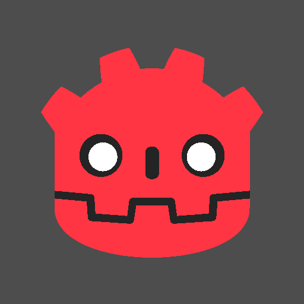

# Day 11: Color Swap / Palette Shift

## Overview



Color Swap replaces specific colors in a sprite with new ones. Two fundamentally different approaches are provided: **Direct** mode matches pixels by color distance and swaps them individually, while **Palette** mode uses a separately authored index texture to drive color lookup from a palette.

---

## Swap Modes

### Direct

Compares each pixel's color against a list of source colors. Any pixel within `tolerance` distance of a source color is replaced with the corresponding target color.

```gdshader
for (int i = 0; i < color_count; i++) {
    float dist = distance(original.rgb, source_colors[i].rgb);
    float t = step(dist, tolerance);
    color = mix(color, vec4(target_colors[i].rgb, original.a), t);
}
```

`step(dist, tolerance)` returns 1.0 when the pixel is within tolerance (no branch needed). `mix()` applies the swap — later entries overwrite earlier ones if multiple source colors match the same pixel.

- **Color Pairs** — Up to 8 source→target color pairs
- **Tolerance** — How closely a pixel must match the source color (0.0 = exact, 1.0 = any color)

### Palette

Uses a dedicated index texture where each pixel's R value acts as a UV coordinate into a palette texture. Changing the palette texture alone swaps all colors simultaneously.

```gdshader
vec4 index_color = texture(index_texture, UV);
vec4 swapped_color = texture(palette_texture, vec2(index_color.r, 0.5));
color = vec4(swapped_color.rgb, index_color.a);
```

The index texture encodes color regions as discrete R values (e.g. 0.0, 0.5, 1.0), each mapping to a point on the palette. The palette texture is sampled at V=0.5, so a 1-pixel-tall horizontal gradient is sufficient.

- **Index Texture** — Grayscale sprite where R values encode color regions
- **Palette Texture** — Horizontal gradient (e.g. `GradientTexture1D`) defining the actual colors

---

## Key Concepts

### 1. Palette Lookup

The palette texture's U coordinate is driven by the index texture's R value, so R=0.0 maps to the leftmost color, R=1.0 to the rightmost, and intermediate values interpolate between adjacent colors. Using `GradientTexture1D` with `Constant` interpolation prevents unintended blending between palette entries.

### 2. Index Texture Preparation

SVG renderers apply anti-aliasing at color boundaries, producing intermediate R values that map to unintended palette positions. The index texture must be pre-processed so that every pixel snaps to one of the defined R values (0.0, 0.5, 1.0 for three regions) with fully binary alpha.

The included `icon_palette_index.png` was generated from the SVG source by snapping each pixel's RGB to the nearest of the three index colors and thresholding alpha at 0.5.

Even with a clean index texture, Godot applies linear interpolation to sampler2D uniforms by default, reintroducing intermediate R values at runtime. The `filter_nearest` hint disables this:

```gdshader
uniform sampler2D index_texture : filter_nearest;
```

This ensures each pixel samples exactly the R value stored in the texture, with no blending between adjacent pixels.

---

## Usage

1. Open `color_swap.tscn` in Godot
2. Select the root node
3. Set **Swap Mode**:
   - **Direct**: Add `ColorPair` entries to **Color Pairs**, set **Tolerance**
   - **Palette**: Assign **Index Texture** (`icon_palette_index.png`) and **Palette Texture** (`GradientTexture1D`)
4. Adjust colors in real time to preview

## Files

- `color_swap.gdshader` — Shader with Direct and Palette swap modes
- `color_swap.tscn` — Test scene with the shared chapter sprite
- `ColorSwap.cs` — C# wrapper with `ColorPair` array and `Resource.Changed` subscription
- `common/ColorPair.cs` — Shared `[GlobalClass, Tool]` Resource for source/target color pairs
- `README.md` — This documentation
