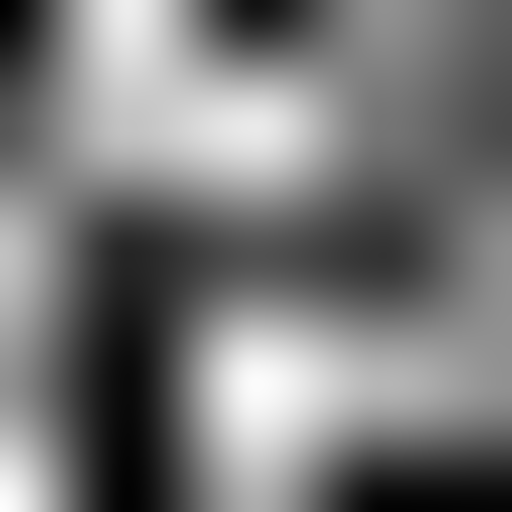
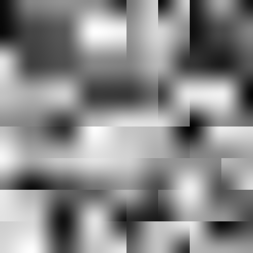

# Day 15: Value Noise

## Overview

Value Noise is the simplest form of procedural noise. The algorithm assigns random values to a grid of lattice points, then interpolates between them to produce a smooth, continuous pattern. It is the conceptual foundation of all noise functions covered in Chapter 3.

---

## Result



---

## How It Works

### 1. Grid and random values

Space is divided into a regular grid. Each integer lattice point receives a pseudo-random value via a hash function:

```gdshader
float random(vec2 p) {
    p = mod(p + seed, 7.31);
    return fract(sin(dot(p, vec2(12.9898, 78.233))) * 43758.5453);
}
```

`mod(p, 7.31)` keeps coordinates in a small range before the `sin` hash. Without this, large input values degrade floating-point precision and produce visible artifacts. The range 7.31 is a non-integer chosen to avoid alignment with the grid period.

### 2. Bilinear interpolation

For a given UV position, the four surrounding lattice points are sampled and blended:

```gdshader
float value_noise(vec2 uv) {
    vec2 i = floor(uv);   // lattice cell index
    vec2 f = fract(uv);   // position within cell (0–1)

    float a = random(i);
    float b = random(i + vec2(1, 0));
    float c = random(i + vec2(0, 1));
    float d = random(i + vec2(1, 1));

    vec2 u = /* interpolation curve applied to f */;
    return mix(mix(a, b, u.x), mix(c, d, u.x), u.y);
}
```

### 3. Interpolation modes

The interpolation curve `u` determines how the transition between lattice values looks:

| Mode       | Formula             | Characteristic                                          |
|------------|---------------------|---------------------------------------------------------|
| Linear     | `f`                 | Fast, but grid boundaries are visible as creases        |
| Smoothstep | `3f² − 2f³`         | Smooth, 1st derivative = 0 at endpoints                 |
| Cubic      | `6f⁵ − 15f⁴ + 10f³` | Smoother, both 1st and 2nd derivatives = 0 at endpoints |

Cubic is the curve used by Perlin Noise and produces the most natural-looking result. Smoothstep is a good default. Linear is included for comparison — the grid structure is clearly visible.

---

## Parameters

| Parameter         | Range                       | Description                                        |
|-------------------|-----------------------------|----------------------------------------------------|
| **Interpolation** | Linear / Smoothstep / Cubic | Blending curve between lattice values              |
| **Frequency**     | 1.0–64.0                    | Number of noise cells across the texture           |
| **Seed**          | 0.0–7.31                    | Offset applied before hashing; changes the pattern |

A **Randomize** button generates a new random seed value.

---

## Key Concepts

### Spatial coherence

Value Noise produces smooth variation because adjacent pixels sample the same interpolated region. Nearby points get similar values — this property is called spatial coherence, and it is what distinguishes noise from pure randomness.

At low frequency the interpolation is clearly visible. As frequency increases, cells shrink until they approach pixel size — at that point the interpolation has no room to operate and the output degrades toward the raw hash function, losing coherence.

### Hash function limitations



The `sin`-based hash works well for typical frequency and seed values, but at certain seeds the floating-point behavior of `sin` can produce visible grid-aligned artifacts — most noticeably as cross-shaped discontinuities. This is an inherent limitation of trigonometric hash functions and would be resolved by switching to an integer bitwise hash.

### Value Noise vs Perlin Noise

Value Noise assigns a **scalar** to each lattice point. The interpolation connects those scalar values directly, which means the grid structure can appear in the output — particularly the characteristic "blotchy" look. Perlin Noise (Day 16) instead assigns **gradient vectors** to lattice points, which eliminates this blotchiness and produces a more natural, flowing pattern.

---

## Usage

1. Open `value_noise.tscn` in Godot
2. Select the root node
3. In the Inspector:
   - **Interpolation** — compare Linear, Smoothstep, and Cubic
   - **Frequency** — increase to see the grid coherence limit
   - **Seed / Randomize** — generate different noise patterns

## Files

- `value_noise.gdshader` — Noise shader with configurable interpolation
- `value_noise.tscn` — Test scene with ColorRect
- `ValueNoise.cs` — C# wrapper with Randomize button
- `README.md` — This documentation
