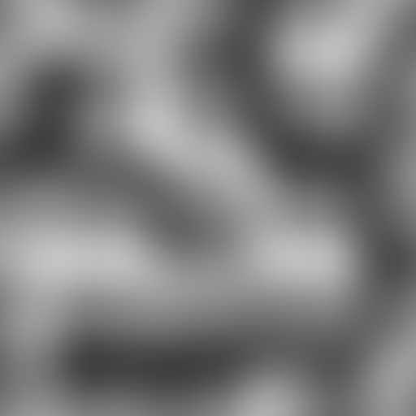
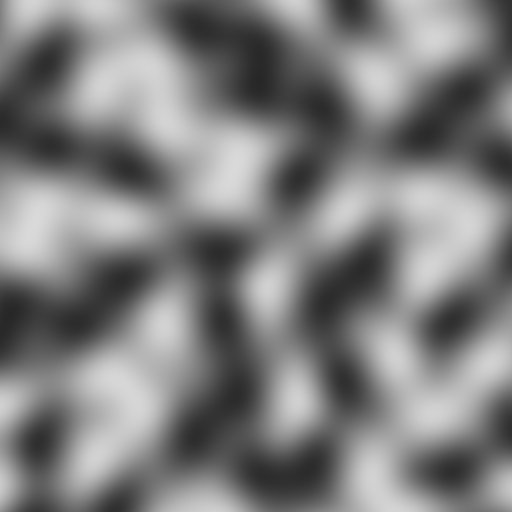

# Day 16: Perlin & Simplex Noise

## Overview

Both Perlin and Simplex Noise are **gradient noise** algorithms — instead of assigning random scalar values to lattice points (as in Value Noise), they assign random gradient vectors. The noise value at any position is derived from dot products between those gradients and distance vectors, producing smooth, flowing patterns with no visible lattice structure.

---

## Algorithms

### Perlin Noise



Perlin Noise operates on a regular square grid. For each fragment, the four surrounding lattice corners contribute a dot product of their gradient vector with the vector pointing from that corner to the current position.

```gdshader
float a = dot(gradient(i),              f);
float b = dot(gradient(i + vec2(1, 0)), f - vec2(1, 0));
float c = dot(gradient(i + vec2(0, 1)), f - vec2(0, 1));
float d = dot(gradient(i + vec2(1, 1)), f - vec2(1, 1));

vec2 u = f * f * f * (f * (f * 6.0 - 15.0) + 10.0); // Cubic quintic
float n = mix(mix(a, b, u.x), mix(c, d, u.x), u.y);
```

The four values are blended using the **cubic quintic curve** (`6t⁵ − 15t⁴ + 10t³`), which ensures both first and second derivatives are zero at lattice boundaries — producing seamless continuity across cells.

### Simplex Noise



Simplex Noise replaces the square grid with a triangular (simplex) grid. Each 2D position falls inside a triangle with only three corners, reducing the sample count from 4 to 3 and reducing directional bias compared to a square grid.

**Skew transform** converts Cartesian coordinates to simplex grid coordinates:

```gdshader
const float F = 0.3660254037; // (sqrt(3) - 1) / 2
vec2 skewed = uv + dot(uv, vec2(F));
vec2 i = floor(skewed);
```

After identifying which triangle the point falls in, each corner contributes via a radial falloff function rather than bilinear interpolation:

```gdshader
vec3 t = max(0.5 - vec3(dot(d0,d0), dot(d1,d1), dot(d2,d2)), 0.0);
t = t * t * t * t; // t⁴ falloff
float n = t.x * dot(gradient(i), d0)
        + t.y * dot(gradient(i + i1), d1)
        + t.z * dot(gradient(i + vec2(1.0)), d2);
```

The `t⁴` falloff ensures each corner's influence drops smoothly to zero at a radius of `sqrt(0.5)`, covering the triangular cell without overlap artifacts.

---

## Gradient Hash

Both algorithms share the same gradient function, which maps a 2D lattice point to a unit vector on the circle:

```gdshader
vec2 gradient(vec2 p) {
    p = mod(p + seed, 7.31);
    float angle = fract(sin(dot(p, vec2(127.1, 311.7))) * 43758.5453) * TAU;
    return vec2(cos(angle), sin(angle));
}
```

Using an angle-based hash ensures gradients are uniformly distributed on the unit circle, avoiding the directional bias that component-wise hashes introduce.

---

## Key Concepts

### 1. Gradient noise vs Value Noise

Value Noise interpolates random scalars — the lattice point value is directly visible in the output, causing the characteristic "blotchy" look. Gradient noise interpolates dot products, which are always zero at the lattice points themselves. This pushes the extremes away from corners and into the interior of cells, producing smoother, more natural-looking variation.

### 2. Output distribution

Both algorithms produce values concentrated near 0.5 after normalization — a bell-curve distribution rather than the uniform distribution of Value Noise.

This is why Perlin and Simplex Noise are rarely used alone — FBM (Day 17) stacks multiple octaves, which naturally spreads the distribution and increases contrast.

### 3. Angle-based gradient hash

The gradient hash converts a scalar hash value into a unit vector via `cos/sin`:

```gdshader
float angle = fract(sin(...) * 43758.5453) * TAU;
return vec2(cos(angle), sin(angle));
```

An alternative is to generate x and y components separately and normalize. However, this maps a uniform distribution on a square to the unit circle, concentrating gradients toward the diagonal directions. The angle-based approach gives a truly uniform circular distribution. In practice Perlin Noise is less sensitive to gradient hash quality than Value Noise — blending across four corners smooths out minor distributional bias — but the angle-based hash is correct by construction.

### 4. Simplex normalization constant

The Simplex output is scaled by `70.0` before `* 0.5 + 0.5` normalization. This constant was determined empirically for the angle-based gradient hash used here. The true maximum output cannot be derived in closed form for this hash, as it depends on the interaction of the `t⁴` falloff with the gradient distribution.

### 5. Perlin vs Simplex

|                     | Perlin                                 | Simplex                    |
|---------------------|----------------------------------------|----------------------------|
| Grid shape          | Square                                 | Triangular                 |
| Corners sampled     | 4                                      | 3                          |
| Blending method     | Cubic quintic interpolation            | `t⁴` radial falloff        |
| Directional bias    | More (axis-aligned artifacts possible) | Less                       |
| Output distribution | Bell curve, 0.5-centred                | Bell curve, slightly wider |

The visual difference is subtle at moderate frequencies. Both require FBM to produce natural-looking results.

---

## Parameters

| Parameter      | Range            | Description                                        |
|----------------|------------------|----------------------------------------------------|
| **Noise Type** | Perlin / Simplex | Algorithm selection                                |
| **Frequency**  | 1.0–64.0         | Number of noise cells across the texture           |
| **Seed**       | 0.0–7.31         | Offset applied before hashing; changes the pattern |

A **Randomize** button generates a new random seed value.

---

## Usage

1. Open `perlin_simplex_noise.tscn` in Godot
2. Select the root node
3. In the Inspector:
   - **Noise Type** — switch between Perlin and Simplex to compare
   - **Frequency** — increase to observe how the bell-curve distribution limits contrast at high frequencies
   - **Seed / Randomize** — generate different gradient assignments

## Files

- `perlin_simplex_noise.gdshader` — Shader implementing both algorithms
- `perlin_simplex_noise.tscn` — Test scene with ColorRect
- `PerlinSimplexNoise.cs` — C# wrapper with Randomize button
- `README.md` — This documentation
