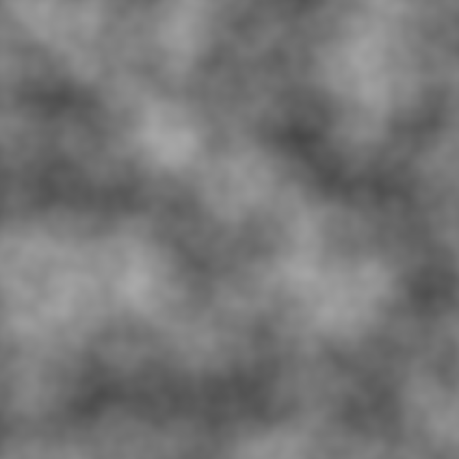

# Day 17: FBM (Fractal Brownian Motion)

## Overview

FBM is not a noise algorithm itself — it is a technique for **combining multiple octaves of noise** to produce fractal-like patterns. Any noise function can serve as the input. Each octave adds finer detail at a higher frequency and lower amplitude, mimicking the self-similar structure found in natural phenomena like terrain, clouds, and coastlines.

---

## Result



---

## How It Works

Each iteration of the loop adds one octave of noise:

```gdshader
float value = 0.0;
float amplitude = 1.0 - gain;
float frequency_accum = 1.0;

for (int i = 0; i < octaves; i++) {
    value += noise(UV * frequency * frequency_accum) * amplitude;
    frequency_accum *= lacunarity;
    amplitude *= gain;
}
```

As octaves accumulate, higher frequencies add progressively finer detail while contributing less to the overall value. The result is a signal with energy at multiple scales simultaneously.

---

## Parameters

| Parameter      | Range                    | Default | Description                         |
|----------------|--------------------------|---------|-------------------------------------|
| **Noise Type** | Value / Perlin / Simplex | Perlin  | Base noise function for each octave |
| **Frequency**  | 1.0–64.0                 | 4.0     | Base frequency of the first octave  |
| **Seed**       | 0.0–7.31                 | 0.0     | Hash offset; changes the pattern    |
| **Octaves**    | 1–8                      | 4       | Number of noise layers to stack     |
| **Lacunarity** | 1.0–4.0                  | 2.0     | Frequency multiplier per octave     |
| **Gain**       | 0.0–1.0                  | 0.5     | Amplitude multiplier per octave     |

A **Randomize** button generates a new random seed value.

---

## Key Concepts

### 1. Self-similarity

At `lacunarity = 2.0` and `gain = 0.5`, each octave is exactly twice as frequent and half as strong as the previous. This produces the same statistical structure at every zoom level — zoom in on any region and it looks similar to the whole. This is the mathematical definition of a fractal, and it matches the `1/f` noise spectrum found throughout nature.

### 2. Amplitude normalization

The initial amplitude is set to `1.0 - gain` rather than a fixed value:

```gdshader
float amplitude = 1.0 - gain;
```

With `gain = 0.5`, the amplitudes form a geometric series `0.5, 0.25, 0.125, ...` that sums to 1.0. Using `1.0 - gain` as the starting value ensures this sum always converges to 1.0 regardless of the gain setting, keeping the output in the `[0, 1]` range without additional normalization.

Perlin is the traditional choice for FBM and produces the most natural results. Value Noise FBM has higher inherent contrast because its output is uniformly distributed across `[0, 1]`, while Perlin and Simplex outputs are bell-curve distributed around 0.5.

### 3. Lacunarity and gain tradeoffs

`lacunarity` controls how quickly detail becomes finer per octave. At 2.0, each octave doubles the frequency. Values below 2.0 produce more gradual transitions between scales; values above 2.0 introduce very fine detail quickly.

`gain` controls how much each octave contributes relative to the previous. At 0.5 (the default), the result is standard Brownian motion. Lower values produce smoother, more gently varying terrain; higher values give rougher, more chaotic surfaces.

---

## Usage

1. Open `fbm.tscn` in Godot
2. Select the root node
3. In the Inspector:
   - **Noise Type** — compare how Value, Perlin, and Simplex differ as FBM base
   - **Octaves** — increase from 1 to see each layer of detail added
   - **Lacunarity / Gain** — observe how they control the fractal character
   - **Seed / Randomize** — generate different terrain patterns

## Files

- `fbm.gdshader` — FBM shader supporting Value, Perlin, and Simplex base noise
- `fbm.tscn` — Test scene with ColorRect
- `Fbm.cs` — C# wrapper exposing all FBM parameters
- `README.md` — This documentation
