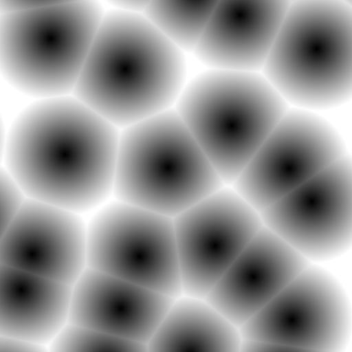
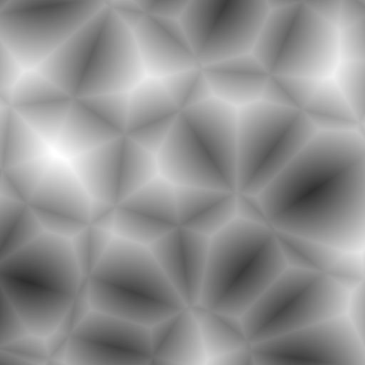
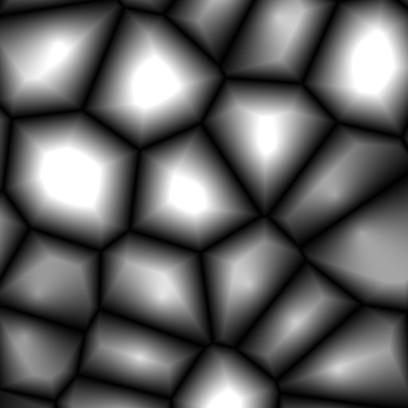

# Day 18: Cellular Noise

## Overview

Cellular Noise (also known as Voronoi or Worley Noise) partitions space based on **distance to randomly placed feature points**. Unlike Value, Perlin, and Simplex Noise which interpolate between lattice values or gradients, Cellular Noise measures how far each pixel is from the nearest seed points, producing an organic cell-like structure.

---

## Modes

### Closest (F1)



Each pixel's value is the distance to the nearest feature point. Cells are brightest at their boundaries and darkest at their centers (nearest to the feature point).

```gdshader
value = f1 * sqrt(2.0);
```

Typical use: organic cell patterns, skin pores, stone textures.

### Second (F2)



Each pixel's value is the distance to the second-nearest feature point. The result is softer and more rounded than F1, with larger apparent cells.

```gdshader
value = f2 / 1.2;
```

### Border (F2 − F1)



Subtracting F1 from F2 isolates the boundary regions between cells. At cell boundaries F1 and F2 are nearly equal, so `F2 − F1 ≈ 0` (dark). In cell interiors F2 is much larger than F1, so the difference is large (bright). The result is a network of dark lines at the Voronoi edges with bright interiors.

```gdshader
value = (f2 - f1) * sqrt(2.0);
```

Typical use: cracked ground, cell walls, cobblestone borders, circuit board traces.

---

## How It Works

For each fragment, the 3×3 neighborhood of surrounding lattice cells is sampled. Each cell contains one randomly placed feature point:

```gdshader
for (int x = -1; x <= 1; x++) {
    for (int y = -1; y <= 1; y++) {
        vec2 neighbor = i + vec2(float(x), float(y));
        vec2 point = neighbor + random2(neighbor); // random position within cell
        float dist = length(point - p);

        if (dist < f1) {
            f2 = f1;
            f1 = dist;
        } else if (dist < f2) {
            f2 = dist;
        }
    }
}
```

`f1` and `f2` are updated simultaneously in a single loop pass — when a new minimum is found, the old minimum is promoted to `f2`.

---

## Key Concepts

### 1. Feature point placement

Each lattice cell contains exactly one feature point at a random position within that cell:

```gdshader
vec2 point = neighbor + random2(neighbor); // [neighbor, neighbor+1]²
```

`random2` returns a vec2 in `[0,1]²`, so the feature point can be anywhere within its cell.

### 2. 3×3 neighborhood

Only 9 surrounding cells are sampled. This is sufficient because feature points are always within `[0,1]` of their cell origin — a feature point from a cell more than one step away can never be closer than a point in an adjacent cell.

### 3. Normalization

The raw distances are scaled to approximately `[0, 1]`:

| Mode    | Scale factor  | Rationale                        |
|---------|---------------|----------------------------------|
| Closest | `× sqrt(2.0)` | Theoretical max F1 ≈ `1/sqrt(2)` |
| Second  | `÷ 1.2`       | Empirically determined           |
| Border  | `× sqrt(2.0)` | F2−F1 bounded similarly to F1    |

These are close approximations rather than exact bounds — exact normalization cannot be derived analytically due to the random nature of feature point placement.

---

## Parameters

| Parameter | Range | Default | Description |
|-----------|-------|---------|-------------|
| **Cell Mode** | Closest / Second / Border | Closest | Distance metric used |
| **Frequency** | 0.01–32.0 | 4.0 | Number of cells across the texture |
| **Seed** | 0.0–7.31 | 0.0 | Hash offset; repositions feature points |

A **Randomize** button generates a new random seed value.

---

## Usage

1. Open `cellular_noise.tscn` in Godot
2. Select the root node
3. In the Inspector:
   - **Cell Mode** — compare Closest, Second, and Border patterns
   - **Frequency** — adjust cell density
   - **Seed / Randomize** — reposition feature points

## Files

- `cellular_noise.gdshader` — Shader with F1, F2, and F2−F1 modes
- `cellular_noise.tscn` — Test scene with ColorRect
- `CellularNoise.cs` — C# wrapper with Randomize button
- `README.md` — This documentation
