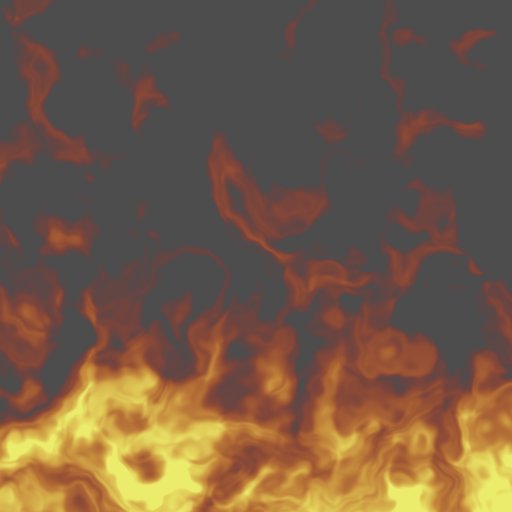

# Day 19: Procedural Fire

## Overview

A fully procedural fire VFX shader that generates animated flame without any textures. The effect combines FBM noise, domain warping, and a UV.y-based shape function to produce a continuously animated, configurable fire effect suitable for use in 2D games.

---

## Result



---

## Pipeline

```
1. Scroll UV upward over time
2. Compute domain warp from FBM
3. Sample fire density FBM using warped UV
4. Apply UV.y² shape function
5. Map fire value to color gradient
6. Output color + alpha
```

### 1. UV Scrolling

```gdshader
vec2 scrolled = UV + vec2(0.0, TIME * speed);
```

Adding `TIME * speed` to UV.y causes the noise pattern to scroll upward over time, creating the impression of rising flames.

### 2. Domain Warping

```gdshader
vec2 warp = vec2(
    fbm(scrolled * frequency),
    fbm(scrolled * frequency + vec2(5.2, 1.3))
);
```

Two independent FBM samples (offset by an arbitrary constant to decorrelate them) warp the UV before the main density sample. This produces the characteristic turbulent, swirling motion of fire rather than a uniform upward flow. The warp FBM uses the same frequency scale as the density FBM so the warping effect is proportional at all frequencies.

### 3. Fire Density

```gdshader
float density = fbm(scrolled * frequency + warp * warp_strength);
```

The final FBM sample uses the warped UV. The raw Perlin FBM output (approximately −0.5 to 0.5) is used directly, without normalization to [0, 1].

### 4. Shape Function

```gdshader
float shape = UV.y * UV.y;
float fire = clamp(density * intensity + shape - threshold, 0.0, 1.0);
```

`UV.y²` is added to the density so that the bottom of the rect (UV.y = 1.0) is almost always filled, and the top (UV.y = 0.0) contributes nothing. Squaring UV.y makes the transition more aggressive than a linear gradient — the base is solid and the top tapers sharply.

`threshold` shifts the entire fire value up or down, controlling how tall the flames reach.

### 5. Color Gradient

```gdshader
vec3 color = mix(color_cool.rgb, color_mid.rgb, fire);
color = mix(color, color_hot.rgb, fire * fire);
```

Two `mix` calls map the fire value to a three-color gradient. `fire * fire` in the second mix accelerates the transition toward `color_hot`, concentrating the hottest color at the fire's densest regions.

| `fire` value | Color                |
|--------------|----------------------|
| 0.0 (edge)   | `color_cool` (red)   |
| 0.5 (mid)    | orange blend         |
| 1.0 (core)   | `color_hot` (yellow) |

The fire value is also used directly as alpha, so edges fade to transparent naturally.

---

## Key Concepts

### Domain Warping

Without domain warping, the scrolling noise produces a uniform upward flow that looks more like smoke than fire. The warp introduces lateral turbulence — each fragment samples noise at a position perturbed by another noise evaluation, producing the folding and swirling motion characteristic of real flames.

The two warp components are sampled at offset positions (`+ vec2(5.2, 1.3)`) so they are statistically independent. Using the same input for both would produce diagonal warping rather than isotropic turbulence.

### UV.y² Shape Function

A linear `UV.y` produces a gradual gradient from top to bottom. Squaring it concentrates the increase in the lower half, making the fire base dense and solid while the upper portion tapers quickly. This asymmetry matches the visual shape of flame — wide and full at the base, pointed and sparse at the tips.

### Raw FBM Output

Unlike Day 17 where FBM was normalized to [0, 1], the fire shader uses the raw Perlin FBM output (approximately −0.5 to 0.5). The negative values contribute to the natural sparseness of the upper flame region — pixels where `density * intensity + shape < threshold` become fully transparent without needing an explicit cutoff.

---

## Parameters

| Parameter         | Range    | Default | Description                     |
|-------------------|----------|---------|---------------------------------|
| **Speed**         | 0.0–10.0 | 1.0     | Upward scroll speed             |
| **Frequency**     | 1.0–16.0 | 4.0     | Noise cell density              |
| **Warp Strength** | 0.0–5.0  | 2.0     | Lateral turbulence intensity    |
| **Intensity**     | 0.5–5.0  | 2.0     | Overall fire density multiplier |
| **Threshold**     | 0.0–1.0  | 0.2     | Fire height cutoff              |
| **Color Hot**     | Color    | Yellow  | Core / base color               |
| **Color Mid**     | Color    | Orange  | Mid-flame color                 |
| **Color Cool**    | Color    | Red     | Edge / tip color                |

---

## Usage

1. Open `fire.tscn` in Godot
2. Add the scene as a child of any node where fire is needed
3. Adjust the `ColorRect` size to control the flame dimensions
4. In the Inspector, tune:
   - **Speed** and **Frequency** for the base animation character
   - **Warp Strength** for turbulence amount
   - **Intensity** and **Threshold** for flame height and density
   - Color properties for visual style

## Files

- `fire.gdshader` — Procedural fire shader using FBM and domain warping
- `fire.tscn` — Test scene with ColorRect
- `Fire.cs` — C# wrapper exposing all shader parameters
- `README.md` — This documentation
