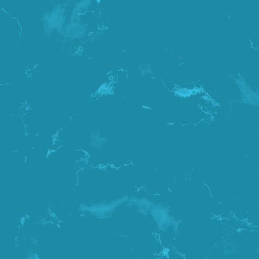

# Day 20: Procedural Water Surface

## Overview

A top-down procedural water surface shader built on FBM Cellular Noise. Rather than simulating wave physics, the effect replicates the visual appearance of **caustics** — the bright, shifting light patterns formed on the bottom of shallow water as sunlight refracts through the moving surface.

The shader combines three layers: a Perlin FBM surface distortion, and two caustic layers at different depths moving at different speeds, creating the impression of looking through animated water.

---

## Result



---

## Pipeline

```
1. Perlin FBM → surface distortion (UV warp)
2. FBM Cellular Noise (shallow layer) → near caustic
3. FBM Cellular Noise (deep layer)   → far caustic
4. Base color + caustic overlay → final color
```

### 1. Surface Distortion

```gdshader
vec2 distortion = vec2(
    fbm_perlin(UV * frequency * 0.5 + TIME * 0.25),
    fbm_perlin(UV * frequency * 0.5 + TIME * 0.25 + vec2(5.2, 1.3))
) * 0.3;
```

Two independent Perlin FBM samples (offset by `vec2(5.2, 1.3)` to decorrelate x and y) warp the UV before caustic sampling. 

### 2. Caustic Layers

Two `fbm_cellular` samples create the shallow and deep caustic layers:

```gdshader
float shallow = fbm_cellular((UV + distortion) * frequency
                              + TIME * wave_speed * vec2(0.3, 0.2));
float deep    = fbm_cellular((UV + distortion * 0.5) * frequency * 0.5
                              + TIME * wave_speed * 0.4 * vec2(0.2, 0.3));
```

The shallow layer receives the full distortion and moves at full speed. The deep layer receives half the distortion (the surface motion is less visible from depth), moves at 40% speed, and uses half the frequency — physically, light diverges over distance so deep caustics are larger and more spread out than shallow ones.

### 3. Range Remapping

```gdshader
float range(float value, float min_val, float max_val, float bias) {
    float remapped = smoothstep(min_val, max_val, value);
    return pow(remapped, log(0.5) / log(bias));
}
```

The raw FBM Cellular output is remapped to isolate only the bright caustic regions. `smoothstep` creates a soft threshold, and the `bias`-controlled power curve sharpens the transition. Only the highest FBM values (where multiple octave rings converge) survive, producing the sparse, concentrated caustic pattern.

---

## Key Concepts

### 1. FBM Cellular Noise for Caustics

Single-layer Cellular Noise (F1 or Border) creates either uniform dark cells or regular geometric rings — neither looks like caustics. Stacking 8 octaves with `lacunarity = 3.0` produces a complex pattern where rings from different scales overlap and interfere, naturally forming the bright, concentrated spots characteristic of real caustics.

```gdshader
for (int i = 0; i < 8; i++) {
    vec2 offset = vec2(float(i) * 1.7321, float(i) * 3.1415);
    value += cellular_f1(p * freq + offset) * amplitude;
    freq *= 3.0;
    amplitude *= 0.5;
}
```

### 2. Depth Parallax

The two caustic layers move at different speeds and scales:

|            | Shallow      | Deep               |
|------------|--------------|--------------------|
| Frequency  | `frequency`  | `frequency × 0.5`  |
| Speed      | `wave_speed` | `wave_speed × 0.4` |
| Distortion | Full         | Half               |
| Brightness | Full         | `× 0.4`            |

The difference in speed between the layers creates a parallax effect — the viewer perceives two planes of caustics at different depths. Physically, light diverges more over longer distances, so deeper caustics are larger, slower, and dimmer.

---

## Parameters

| Parameter              | Range    | Default    | Description                     |
|------------------------|----------|------------|---------------------------------|
| **Wave Speed**         | 0.0–10.0 | 1.5        | Overall caustic animation speed |
| **Frequency**          | 0.5–32.0 | 8.0        | Caustic cell density            |
| **Color Deep**         | Color    | Teal       | Base water color                |
| **Color Caustic**      | Color    | Light blue | Caustic highlight color         |
| **Caustic Brightness** | 0.0–5.0  | 0.4        | Intensity of caustic overlay    |

---

## Usage

1. Open `water.tscn` in Godot
2. Resize the `ColorRect` to cover the desired water area
3. In the Inspector, adjust **Wave Speed**, **Frequency**, and colors to match the scene

## Files

- `water.gdshader` — Procedural water shader with two-layer FBM caustics
- `water.tscn` — Test scene with ColorRect
- `Water.cs` — C# wrapper exposing essential parameters
- `README.md` — This documentation
