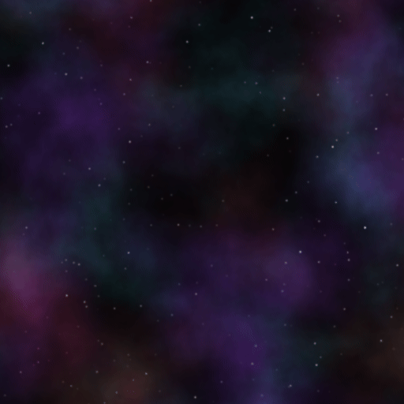

# Day 21: Procedural Space Background

## Overview

A fully procedural animated space background combining a multi-layer star field with FBM-based nebulae. All elements are generated mathematically — no textures required. Stars and nebulae move at different speeds to create parallax depth, and nebulae naturally occlude background stars based on their density.

This is the Chapter 3 mini-project, bringing together FBM (Day 17), Domain Warping (Day 19), and multi-layer compositing techniques into a single practical background effect.

---

## Result



---

## Pipeline

```
1. Star field  — four rotated grid layers at different densities → parallax depth
2. Nebula      — three FBM + Domain Warp layers → colored gas clouds
3. Occlusion   — nebula luminance dims stars behind it
4. Composite   — nebula + dimmed stars
```

---

## Star Field

Four layers of stars are rendered at different angles and densities:

```gdshader
stars = max(stars, star_layer(UV + TIME * 0.008, 50.0, 0.0,   0.0));
stars = max(stars, star_layer(UV + TIME * 0.006, 60.0, 0.785, 1.7));
stars = max(stars, star_layer(UV + TIME * 0.004, 70.0, 0.393, 3.3));
stars = max(stars, star_layer(UV + TIME * 0.002, 80.0, 1.178, 5.1));
```

Each layer rotates the UV by a different angle (0°, 45°, 22.5°, 67.5°) before hashing to a grid. Overlapping grids at multiple angles removes axis-aligned regularity, producing a distribution that reads as random at normal viewing distance.

Lower density layers move faster, representing nearer stars. Higher density layers move slower, representing distant background stars. This speed difference produces the parallax depth effect.

Each cell uses four independent hash values:
- **r1** — star existence (3% probability)
- **r2** — size variation (0.05–0.20 of cell)
- **r3** — brightness variation (0.4–1.0 multiplier)
- **r4** — color tint (blue-white / yellow-white / orange-white)

### Anti-aliasing

Stars smaller than 4 pixels in diameter flicker as they move sub-pixel distances — the star can fall between pixels and appear to disappear. To prevent this, the minimum star size is clamped to a 2-pixel radius:

```gdshader
float pixel_radius = texture_pixel_size.x * density * 2.0;
```

When a star's natural size falls below this threshold, it is rendered at `pixel_radius` but with brightness reduced proportionally to its actual area:

```gdshader
if (size < pixel_radius) {
    display_size = pixel_radius;
    area_scale = (size / pixel_radius) * (size / pixel_radius);
}
float brightness = (0.4 + r3 * 0.6) * area_scale;
```

This ensures every star spans at least 4 pixels, so sub-pixel movement causes smooth brightness transitions across neighboring pixels rather than abrupt flickering.

---

## Nebula

Three nebula layers are composited additively, each sampling a different region of the noise field:

```gdshader
nebula += nebula_layer(UV + TIME * 0.005,  2.5, vec2(0.0, 0.0), nebula_color1, 2.0);
nebula += nebula_layer(UV + TIME * 0.0075, 3.5, vec2(3.7, 1.9), nebula_color2, 2.5);
nebula += nebula_layer(UV + TIME * 0.01,   2.0, vec2(7.3, 4.2), nebula_color3, 3.0);
```

Each layer applies Domain Warping before the main FBM sample:

```gdshader
vec2 warp = vec2(
    fbm(uv * scale * 0.5 + offset),
    fbm(uv * scale * 0.5 + offset + vec2(5.2, 1.3))
) * 0.4;
float density = fbm(uv * scale + offset + warp);
```

The warp distorts the noise coordinates before sampling, producing the swirling, organic shapes characteristic of real nebulae. A falloff remapping concentrates density and creates natural transparent edges:

```gdshader
density = pow(max(0.0, density - 0.3) / 0.7, falloff);
```

Values below 0.3 become zero (transparent gaps), and the power curve sharpens the remaining density. Higher `falloff` creates more concentrated clouds; lower values spread the gas further.

---

## Star Occlusion

Stars behind dense nebula are dimmed proportionally to the nebula's luminance:

```gdshader
float nebula_density = dot(nebula, vec3(0.299, 0.587, 0.114));
float star_visibility = 1.0 - clamp(nebula_density * star_occlusion, 0.0, 1.0);
COLOR = vec4(nebula + stars * star_visibility, 1.0);
```

Where the nebula is bright, stars fade. Where the nebula is absent, stars appear at full brightness. `star_occlusion` controls the strength of this effect.

---

## Key Concepts

### Multi-angle grid for natural star distribution

A single axis-aligned grid produces a distribution with subtle horizontal and vertical regularity. Overlapping four grids at 0°, 22.5°, 45°, and 67.5° removes any dominant axis and produces a pattern that reads as random at normal viewing distance.

### Minimum star size for temporal anti-aliasing

Stars smaller than ~4 pixels produce visible temporal aliasing — as a star moves sub-pixel distances with the parallax scrolling, its apparent brightness oscillates between frames. Clamping to a minimum of 2-pixel radius ensures the Gaussian footprint spans multiple pixels, so any given sub-pixel movement produces only a small, smooth brightness redistribution rather than a discrete on/off flicker.

### Domain Warping for organic nebula shapes

Plain FBM produces smooth, cloud-like blobs. Sampling FBM at positions already displaced by another FBM evaluation (domain warping) introduces curling and asymmetry that matches the appearance of real gas nebulae.

---

## Parameters

| Parameter             | Range   | Default | Description                                   |
|-----------------------|---------|---------|-----------------------------------------------|
| **Nebula Color 1**    | Color   | Purple  | Color of the first nebula layer               |
| **Nebula Color 2**    | Color   | Teal    | Color of the second nebula layer              |
| **Nebula Color 3**    | Color   | Red     | Color of the third nebula layer               |
| **Nebula Brightness** | 0.0–2.0 | 1.3     | Overall nebula intensity                      |
| **Star Occlusion**    | 0.0–5.0 | 2.0     | How strongly nebula obscures background stars |

### Known Limitation

`texture_pixel_size` is hardcoded as `vec2(1.0 / 512.0)` to match the 512×512 texture. If the texture size changes, this constant must be updated manually.

---

## Usage

1. Open `background.tscn` in Godot
2. Place the scene on a `CanvasLayer` with a negative layer index so it renders behind all game elements
3. Set the `ColorRect` to cover the full viewport
4. Adjust nebula colors to match the scene's visual theme

## Files

- `background.gdshader` — Procedural space background shader
- `background.tscn` — Test scene with ColorRect
- `Background.cs` — C# wrapper exposing nebula color and brightness parameters
- `README.md` — This documentation
