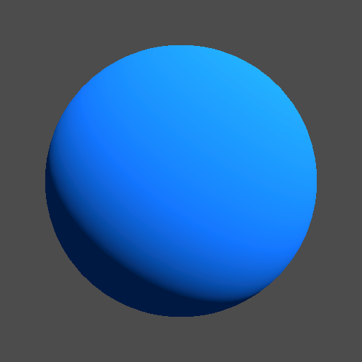
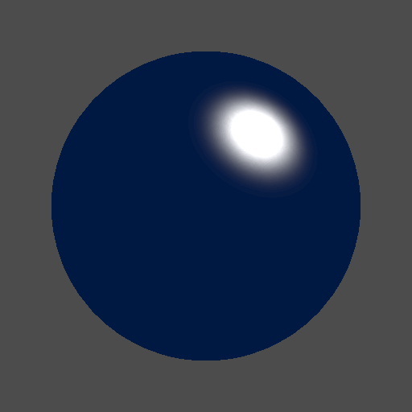
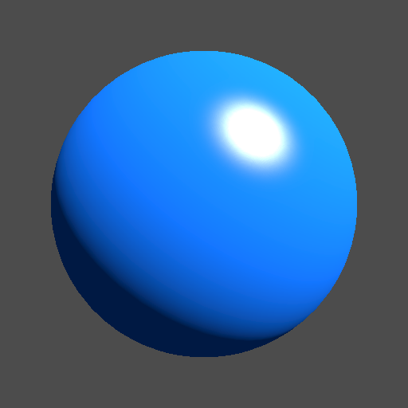

# Day 22: Diffuse & Specular Lighting

## Overview

Implements the classic Phong and Blinn-Phong lighting models from scratch using Godot's `spatial` shader `light()` function. Separates the two core components of local illumination — diffuse and specular — with individual intensity controls to observe each component's contribution independently.

This is the first shader in Chapter 4 to use `shader_type spatial`, introducing the `light()` function and the `MeshInstance3D` + `Camera3D` + `DirectionalLight3D` scene structure used throughout the chapter.

---

## Diffuse



The diffuse term models how a surface scatters incoming light equally in all directions. Brightness depends only on the angle between the surface normal and the light direction — not the viewer's position.

```gdshader
float ndotl = max(0.0, dot(NORMAL, LIGHT));
vec3 diffuse = ndotl * LIGHT_COLOR;
```

`NORMAL` and `LIGHT` are both in view space and already normalized. `max(0.0, ...)` clamps negative values so surfaces facing away from the light contribute nothing.

---

## Specular



The specular term models mirror-like reflection. Unlike diffuse, it is view-dependent — the highlight shifts as the camera moves. Two methods are available.

### Phong

Reflects the light vector around the surface normal, then measures the angle to the view direction.

```gdshader
vec3 reflect_dir = reflect(-LIGHT, NORMAL);
spec = pow(max(0.0, dot(reflect_dir, VIEW)), specular_power);
```

### Blinn-Phong

Uses a halfway vector between the light and view directions instead of a reflection vector. Produces a softer, broader highlight at the same `specular_power` value.

```gdshader
vec3 half_vector = normalize(LIGHT + VIEW);
spec = pow(max(0.0, dot(NORMAL, half_vector)), specular_power);
```

`specular_power` controls highlight concentration — higher values produce a smaller, sharper spot.

---

## Combined



Diffuse and specular accumulate into separate built-ins. Godot composites the final pixel as `ALBEDO × DIFFUSE_LIGHT + SPECULAR_LIGHT`.

```gdshader
DIFFUSE_LIGHT += ndotl * LIGHT_COLOR * diffuse_intensity;
SPECULAR_LIGHT += spec * LIGHT_COLOR * specular_intensity;
```

---

## Key Concepts

### `light()` in Godot spatial shaders

Unlike `fragment()`, which runs once per pixel, `light()` is called once per pixel per light source. Results accumulate across multiple lights via `+=`.

```gdshader
void light() {
    DIFFUSE_LIGHT += ...;
    SPECULAR_LIGHT += ...;
}
```

### ALBEDO vs DIFFUSE_LIGHT

Surface color and lighting are intentionally separated:

```gdshader
void fragment() {
    ALBEDO = color.rgb;  // what the surface is
}

void light() {
    DIFFUSE_LIGHT += ...;  // how light affects it
}
```

### Phong vs Blinn-Phong

|             | Reflection vector         | Dot product                |
|-------------|---------------------------|----------------------------|
| Phong       | `reflect(-LIGHT, NORMAL)` | `dot(reflect_dir, VIEW)`   |
| Blinn-Phong | `normalize(LIGHT + VIEW)` | `dot(NORMAL, half_vector)` |

For a directional light with a distant camera, `H` is constant across the surface and can be computed once per vertex, whereas Phong's `reflect(-L, N)` depends on `N` and must be evaluated per-fragment.

---

## Parameters

| Parameter              | Range               | Default | Description                                                  |
|------------------------|---------------------|---------|--------------------------------------------------------------|
| **Shading Mode**       | Phong / Blinn-Phong | Phong   | Specular calculation method                                  |
| **Diffuse Intensity**  | 0.0–1.0             | 1.0     | Diffuse component strength                                   |
| **Specular Intensity** | 0.0–1.0             | 1.0     | Specular component strength                                  |
| **Specular Power**     | 0.0–128.0           | 32.0    | Highlight concentration; higher = smaller, sharper highlight |
| **Color**              | Color               | Blue    | Surface base color (ALBEDO)                                  |

---

## Usage

1. Open `diffuse_specular.tscn` in Godot
2. The scene contains a `SubViewport` with a `Camera3D`, `DirectionalLight3D`, and `MeshInstance3D` (sphere)
3. Select the root node to adjust parameters in the Inspector
4. Set `Diffuse Intensity` to 0 to isolate the specular component, or `Specular Intensity` to 0 to isolate diffuse

---

## Files

- `diffuse_specular.gdshader` — Phong and Blinn-Phong lighting shader
- `diffuse_specular.tscn` — Test scene with sphere mesh, camera, and directional light
- `DiffuseSpecular.cs` — C# wrapper exposing shading mode and intensity parameters
- `README.md` — This documentation
