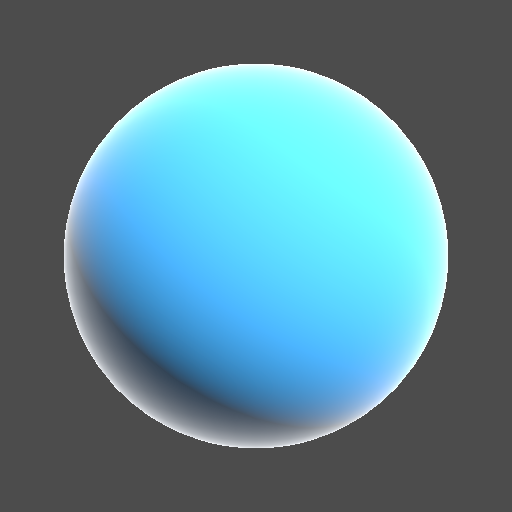
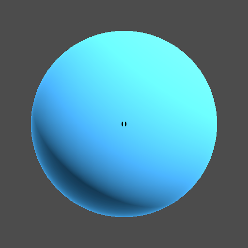

# Day 23: Rim Lighting

## Overview

Adds a rim (silhouette) highlight to a 3D surface using two distinct approaches: a view-dependent mask applied via `EMISSION`, and a physically-inspired backlit effect computed in `light()`.

---

## View Only



Computes rim purely from the angle between the surface normal and the view direction. The highlight appears uniformly around the entire silhouette regardless of light position. Commonly used for stylistic character outlines or sci-fi glow effects.

```gdshader
float rim = pow(1.0 - max(0.0, dot(NORMAL, VIEW)), rim_power);
EMISSION = rim_color.rgb * rim * rim_intensity;
```

Applied via `EMISSION` so the rim is unaffected by lighting — it adds to the final color independently of diffuse and specular.

---

## Backlit



Combines the view-based rim with a backlight term. The rim only appears where the surface is both facing away from the light and at a grazing angle to the camera — simulating a physical backlight placed behind the object. Used in cinematic lighting rigs to separate a subject from the background more naturally than a uniform halo.

```gdshader
float backlight = 1.0 - max(0.0, dot(NORMAL, LIGHT));
float rim = backlight * pow(1.0 - max(0.0, dot(NORMAL, VIEW)), rim_power);
DIFFUSE_LIGHT += rim_color.rgb * rim * rim_intensity;
```

Applied via `DIFFUSE_LIGHT` inside `light()` since it depends on `LIGHT`, which is only accessible there.

---

## Key Concepts

### EMISSION vs DIFFUSE_LIGHT

The two modes use different output built-ins because they have different relationships with lighting:

```
final color = ALBEDO × (DIFFUSE_LIGHT + ambient) + SPECULAR_LIGHT + EMISSION
```

|           | Output          | Light-dependent       |
|-----------|-----------------|-----------------------|
| View Only | `EMISSION`      | ❌ always visible      |
| Backlit   | `DIFFUSE_LIGHT` | ✅ only on shadow side |

Adding to `ALBEDO` instead would make the rim disappear in unlit areas, since `ALBEDO` is multiplied by `DIFFUSE_LIGHT`.

### Rim mask

Both modes share the same base rim term — the inverse of the normal-view dot product:

```gdshader
float rim = pow(1.0 - max(0.0, dot(NORMAL, VIEW)), rim_power);
```

When `NORMAL` and `VIEW` are parallel (surface faces camera directly), `dot = 1` → `rim = 0`. When perpendicular (silhouette edge), `dot = 0` → `rim = 1`. `rim_power` sharpens or softens the falloff.

### Backlit term

The backlit multiplier selects only surfaces facing away from the light:

```gdshader
float backlight = 1.0 - max(0.0, dot(NORMAL, LIGHT));
```

Multiplying `backlight × rim` restricts the effect to the shadow-side silhouette, producing a backlight rather than a uniform halo.

---

## Parameters

| Parameter         | Range               | Default   | Description                             |
|-------------------|---------------------|-----------|-----------------------------------------|
| **Rim Type**      | View Only / Backlit | View Only | Rim calculation method                  |
| **Rim Color**     | Color               | White     | Color of the rim highlight              |
| **Rim Power**     | 0.0–16.0            | 4.0       | Falloff sharpness; higher = thinner rim |
| **Rim Intensity** | 0.0–1.0             | 1.0       | Overall rim strength                    |

---

## Usage

1. Open `rim_lighting.tscn` in Godot
2. Select the root node to adjust parameters in the Inspector
3. Switch `Rim Type` to compare the uniform halo (View Only) against the shadow-side backlight (Backlit)

---

---

## Files

- `rim_lighting.gdshader` — Rim lighting shader with View Only and Backlit modes
- `rim_lighting.tscn` — Test scene with sphere mesh, camera, and directional light
- `RimLighting.cs` — C# wrapper exposing rim type, color, power, and intensity
- `README.md` — This documentation
