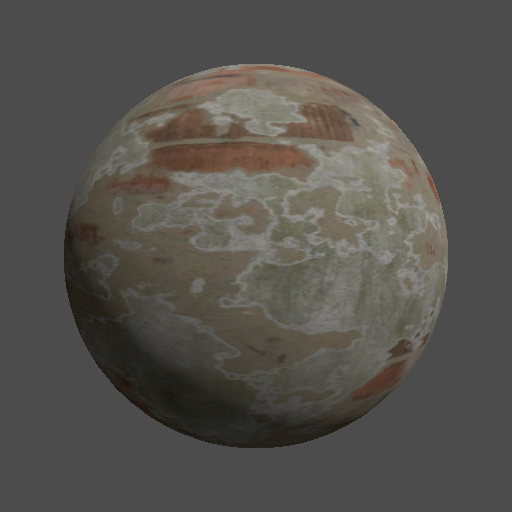
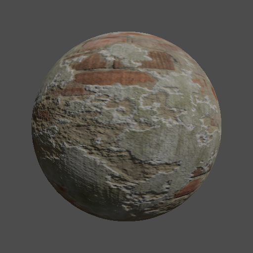

# Day 24: Normal Mapping

## Overview

Implements normal mapping by manually constructing the TBN matrix to transform tangent-space normals into view space.

---

## Without Normal Map



Base diffuse lighting on a flat sphere surface. All normals are geometric — the surface appears smooth regardless of the albedo texture's detail.

---

## With Normal Map



Normals are perturbed per-pixel using the normal map texture. Surface detail appears without adding geometry — bumps, grooves, and surface variation are simulated purely through lighting. Commonly used for adding high-frequency surface detail to low-poly meshes across all genres of 3D games.

---

## Key Concepts

### Tangent space

Normal maps store normals relative to the surface itself, not the world or view. This tangent space has three axes:

- **T (Tangent)**: along the surface in the U direction
- **B (Binormal)**: along the surface in the V direction
- **N (Normal)**: perpendicular to the surface

A flat surface stores `(0.5, 0.5, 1.0)` in the texture, which decodes to `(0, 0, 1)` — pointing straight up from the surface. Any deviation from this shifts the apparent lighting direction.

### TBN matrix

Transforms a tangent-space normal into view space so it can be used in lighting calculations:

```gdshader
vec3 n = texture(normal_map, UV).rgb * 2.0 - 1.0;
mat3 TBN = mat3(TANGENT, BINORMAL, -NORMAL);
NORMAL = normalize(TBN * n);
```

`* 2.0 - 1.0` remaps the texture's `[0, 1]` range to the vector range `[-1, 1]`.

> **Godot-specific**: In Godot 4's fragment shader, `NORMAL` stores the inward-facing normal. Using `-NORMAL` as the TBN Z basis matches the behavior of the built-in `NORMAL_MAP` output.

### DirectX vs OpenGL normal maps

Normal maps come in two Y-axis conventions:

| Format | Green channel | Use with |
|--------|--------------|----------|
| DirectX (DX) | Y+ = down | Unity, DirectX |
| OpenGL (GL) | Y+ = up | Godot, Blender |

Godot expects OpenGL-format normal maps. Using a DirectX map produces incorrect shading — light appears to come from the wrong direction.

### `hint_normal`

Declaring the normal map uniform with `hint_normal` tells Godot to treat the texture as linear (not sRGB), which is required for correct normal decoding:

```gdshader
uniform sampler2D normal_map : hint_normal;
```

---

## Parameters

| Parameter          | Type | Default | Description           |
|--------------------|------|---------|-----------------------|
| **Use Albedo Map** | bool | true    | Toggle albedo texture |
| **Use Normal Map** | bool | true    | Toggle normal map     |

---

## Usage

1. Open `normal_mapping.tscn` in Godot
2. Assign `PaintedPlaster010_Color.jpg` to `albedo_map` and `PaintedPlaster010_NormalGL.jpg` to `normal_map` in the inspector
3. Toggle `Use Normal Map` to compare flat vs normal-mapped shading
4. Toggle `Use Albedo Map` to isolate the lighting effect from surface color

---

## Files

- `normal_mapping.gdshader` — Normal mapping shader with manual TBN construction
- `normal_mapping.tscn` — Test scene with sphere mesh, camera, and directional light
- `NormalMapping.cs` — C# wrapper exposing albedo and normal map toggles
- `README.md` — This documentation
