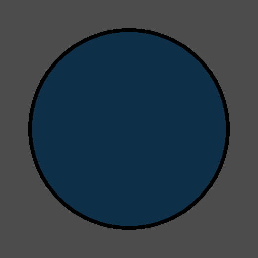

# Day 25: Toon/Cel Shading

## Overview

Implements cel shading by quantizing diffuse and specular lighting into discrete bands, combined with a clip-space outline using `next_pass`. Two shaders work together on the same mesh: `toon_shading.gdshader` for the surface, and `outline.gdshader` as a second render pass.

---

## Result


## Diffuse Quantization


Lambert `ndotl` is stepped into discrete bands using `floor()`, replacing the smooth lighting gradient with flat color regions characteristic of cel shading. Used in stylized games to simulate hand-drawn animation lighting.

```gdshader
float ndotl = max(0.0, dot(NORMAL, LIGHT));
float toon = floor(ndotl * float(diffuse_steps)) / float(diffuse_steps);
DIFFUSE_LIGHT += toon * LIGHT_COLOR;
```

`diffuse_steps` controls the number of shading bands — 2 gives a stark light/dark split, higher values approximate smooth shading.

---

## Specular


Blinn-Phong specular is binarized with `step()` — either fully on or fully off — producing a sharp highlight rather than a soft falloff.

```gdshader
vec3 h = normalize(LIGHT + VIEW);
float spec = pow(max(0.0, dot(NORMAL, h)), 16.0);
float toon_spec = step(specular_threshold, spec);
SPECULAR_LIGHT += toon_spec * LIGHT_COLOR;
```

`specular_threshold` controls where the highlight appears — lower values produce a larger highlight area.

---

## Outline



A second render pass inflates the mesh in clip space along the surface normal direction and renders only back faces in a solid color, creating a view-consistent outline. Used in virtually all cel-shaded games to reinforce the hand-drawn look.

```gdshader
// outline.gdshader
render_mode cull_front, unshaded;

void vertex() {
    vec4 clip_pos = PROJECTION_MATRIX * MODELVIEW_MATRIX * vec4(VERTEX, 1.0);
    vec4 clip_normal = PROJECTION_MATRIX * MODELVIEW_MATRIX * vec4(NORMAL, 0.0);

    float aspect = VIEWPORT_SIZE.x / VIEWPORT_SIZE.y;
    vec2 offset = normalize(clip_normal.xy) * outline_thickness * clip_pos.w;
    offset.x /= aspect;

    clip_pos.xy += offset;
    POSITION = clip_pos;
}
```

---

## Key Concepts

### Clip-space outline

Inflating the mesh in **local space** (`VERTEX += NORMAL * thickness`) produces outlines that grow thicker as the camera gets closer. The clip-space approach compensates by multiplying the offset by `clip_pos.w`, which cancels out after perspective division, keeping outline thickness constant in screen space.

Dividing `offset.x` by the viewport aspect ratio corrects the elliptical distortion that would otherwise appear on non-square viewports.

---

## Parameters

| Parameter | Range | Default | Description |
|---|---|---|---|
| **Diffuse Steps** | 1–10 | 4 | Number of discrete diffuse shading bands |
| **Specular Threshold** | 0.0–1.0 | 0.5 | Specular highlight cutoff point |
| **Outline Thickness** | 0.0–0.3 | 0.03 | Clip-space outline width |
| **Outline Color** | Color | Black | Outline fill color |

---

## Usage

1. Open `toon_shading.tscn` in Godot
2. Select the root node to adjust parameters in the Inspector
3. Adjust `Diffuse Steps` to control the number of shading bands
4. Set `Specular Threshold` close to 1.0 to shrink the highlight, or toward 0.0 to expand it

---

## Files

- `toon_shading.gdshader` — Quantized diffuse and specular lighting
- `outline.gdshader` — Clip-space back-face outline pass
- `toon_shading.tscn` — Test scene with sphere mesh, camera, and directional light
- `ToonShading.cs` — C# wrapper routing parameters to first and second material passes
- `README.md` — This documentation
