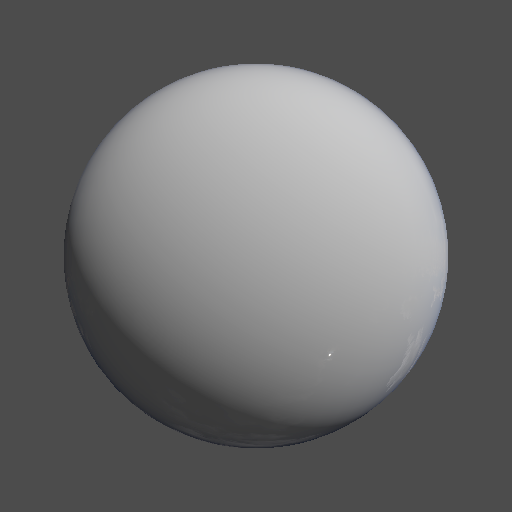

# Day 26: Environment Mapping

## Overview

Implements environment mapping by computing a reflection vector in view space, transforming it to world space, and sampling a panoramic (equirectangular) HDR texture. Fresnel blending controls how much of the environment is reflected based on the viewing angle — physically motivated by how real dielectric surfaces behave.

---

## Result



---

## Key Concepts

### Reflection vector

The reflection vector represents the direction light would bounce off the surface toward the camera:

```gdshader
vec3 reflection = reflect(-VIEW, NORMAL);
```

`VIEW` points toward the camera, so `-VIEW` is the incoming direction. `reflect()` mirrors it around `NORMAL`.

### View space → World space

The reflection vector is computed in view space, but the environment map is in world space. `INV_VIEW_MATRIX` transforms between the two:

```gdshader
vec3 world_reflection = normalize((INV_VIEW_MATRIX * vec4(reflection, 0.0)).xyz);
```

Passing `0.0` as the w component ensures only rotation is applied, not translation.

### Panorama UV conversion

A cubemap would sample directly with a direction vector, but an equirectangular texture requires converting the 3D direction to 2D UV coordinates using spherical coordinates:

```gdshader
vec2 panorama_uv = vec2(
    atan(world_reflection.z, world_reflection.x) / TAU + 0.5,
    asin(world_reflection.y) / PI + 0.5
);
vec3 env_color = texture(environment_map, panorama_uv).rgb;
```

`atan` maps the horizontal angle (longitude) and `asin` maps the vertical angle (latitude) to the `[0, 1]` UV range.

### Fresnel blending

Real dielectric surfaces (glass, water, plastic) reflect more at grazing angles and less when viewed head-on. Fresnel blending approximates this physically:

```gdshader
float fresnel = pow(1.0 - max(0.0, dot(NORMAL, VIEW)), 5.0);
ALBEDO = mix(surface_color, env_color, fresnel);
```

When `NORMAL` and `VIEW` are parallel (facing the camera directly), `fresnel ≈ 0` → surface color dominates. At grazing angles, `fresnel → 1` → environment reflection dominates. The exponent `5.0` is Schlick's approximation for a typical dielectric material.

A flat `reflection_strength` uniform would give angle-independent reflection, approximating a metallic surface instead.

---

## Parameters

This shader has no C# wrapper — the environment map texture is assigned directly in the Godot inspector.

| Uniform             | Type      | Description                  |
|---------------------|-----------|------------------------------|
| **environment_map** | Texture2D | Equirectangular HDR panorama |

---

## Usage

1. Open `environment.tscn` in Godot
2. Select the `MeshInstance3D` and open the `ShaderMaterial`
3. Assign an equirectangular HDR texture to `environment_map`
4. Rotate the `DirectionalLight3D` or camera to observe the view-dependent reflection

---

## Files

- `environment.gdshader` — Environment mapping shader with Fresnel blending
- `environment.tscn` — Test scene with sphere mesh, camera, and directional light
- `README.md` — This documentation
