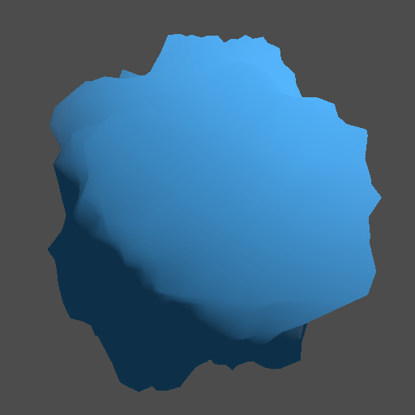
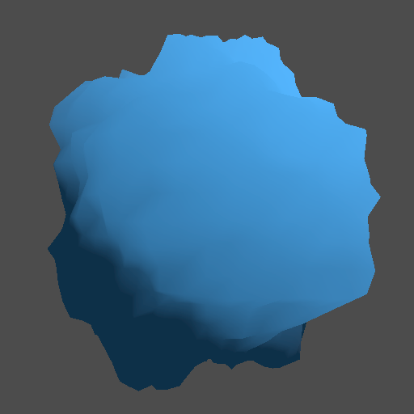

# Day 27: Vertex Deformation

## Overview

Deforms mesh geometry at runtime by displacing vertices along their normal direction using a scrolling noise texture. The first shader in Chapter 4 to make meaningful use of `vertex()` — all previous days operated exclusively in `fragment()` and `light()`.

Includes a normal recalculation toggle to compare correct vs incorrect lighting on deformed geometry.

---

## Without Normal Recalculation



Vertices are displaced but normals remain from the original sphere geometry. Lighting is computed against the undeformed surface, causing shading to mismatch the actual visible shape — most noticeable at high amplitude.

---

## With Normal Recalculation



Normals are approximated from the noise gradient by sampling at nearby UV offsets, producing lighting that matches the displaced surface. Used in terrain rendering, animated water surfaces, and any effect where vertex displacement needs to look correctly lit.

---

## Key Concepts

### `vertex()` and `VERTEX`

`VERTEX` is the mesh vertex position in local space. Writing to it deforms the geometry:

```gdshader
void vertex() {
    float noise = textureLod(noise_texture, UV * frequency + TIME * scroll_speed, 0.0).r;
    noise = noise * 2.0 - 1.0; // remap [0,1] → [-1,1]
    VERTEX += NORMAL * noise * amplitude;
}
```

Displacement is applied along `NORMAL` so the surface expands and contracts uniformly.

### `textureLod()` in vertex shaders

`texture()` requires implicit LOD calculation from screen-space derivatives, which is unavailable in `vertex()`. `textureLod()` makes the LOD level explicit:

```gdshader
textureLod(noise_texture, uv, 0.0) // 0.0 = full resolution mipmap
```

### Normal recalculation

Displacing vertices invalidates the original mesh normals. The new normal is approximated by sampling the noise at nearby UV positions and computing the surface gradient:

```gdshader
float eps = 0.01;
float n0 = noise; // already computed
float nx = textureLod(noise_texture, uv + vec2(eps, 0.0), 0.0).r * 2.0 - 1.0;
float ny = textureLod(noise_texture, uv + vec2(0.0, eps), 0.0).r * 2.0 - 1.0;
NORMAL = normalize(NORMAL + vec3(n0 - nx, n0 - ny, 1.0) * amplitude);
```

The same `uv` variable is reused across all three samples to ensure they reference the same point in time as the displacement.

---

## Parameters

| Parameter               | Range    | Default | Description                                       |
|-------------------------|----------|---------|---------------------------------------------------|
| **Amplitude**           | 0.0–1.0  | 0.2     | Displacement strength                             |
| **Frequency**           | 0.0–10.0 | 1.0     | Noise UV scale; higher = finer detail             |
| **Scroll Speed**        | 0.0–2.0  | 0.5     | Noise animation speed                             |
| **Recalculate Normals** | bool     | true    | Toggle normal recalculation for deformed geometry |

---

## Usage

1. Open `vertex_deformation.tscn` in Godot
2. Create a `NoiseTexture2D` resource and assign it to `noise_texture` in the inspector
3. Toggle `Recalculate Normals` to compare lighting on deformed vs original normals
4. Increase `Amplitude` to make the difference more visible

---

## Files

- `vertex_deformation.gdshader` — Noise-based vertex displacement with optional normal recalculation
- `vertex_deformation.tscn` — Test scene with sphere mesh, camera, and directional light
- `README.md` — This documentation
