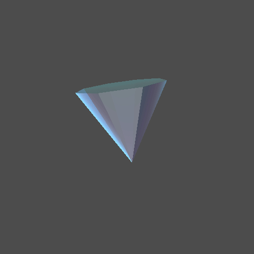

# Day 28: Mini Project — Stylized Crystal

## Overview

Chapter 4 mini project combining multiple lighting and rendering techniques into a single stylized crystal shader. Applied to a low-poly hexagonal cylinder mesh to produce distinct facets.

Techniques used: Fresnel transparency, fake screen-space refraction with chromatic aberration, flat-normal per-face lighting, rim lighting, iridescence, and front/back face differentiation.

---

## Result



---

## Techniques

### Fresnel transparency

The crystal is transparent when viewed head-on and opaque at grazing angles — the same physical behavior as glass and water:

```gdshader
float fresnel = pow(1.0 - max(0.0, dot(NORMAL, VIEW)), fresnel_power);
ALPHA = max(base_alpha, fresnel);
```

### Fake refraction with chromatic aberration

The screen texture is sampled with an offset based on the surface normal, simulating light bending through the crystal. R, G, B channels are offset at different strengths to produce prism-like color dispersion:

```gdshader
vec2 refraction_offset = NORMAL.xy * refraction_strength;
float r = texture(screen_texture, SCREEN_UV + refraction_offset * 1.0).r;
float g = texture(screen_texture, SCREEN_UV + refraction_offset * 1.2).g;
float b = texture(screen_texture, SCREEN_UV + refraction_offset * 1.4).b;
vec3 refraction = vec3(r, g, b);

ALBEDO = mix(refraction, crystal_color.rgb, fresnel);
```

### Flat-normal per-face lighting

`dFdx`/`dFdy` screen-space derivatives reconstruct the geometric face normal regardless of the mesh's smooth vertex normals, making each polygonal face receive uniform lighting — critical for the faceted gem look:

```gdshader
NORMAL = normalize(cross(dFdx(VERTEX), dFdy(VERTEX)));
```

Combined with multiple directional lights at different angles, each face either catches light fully or remains dark, producing the characteristic gem sparkle.

### Sharp per-face diffuse

Standard Lambert gives gradual light falloff. Raising `ndotl` to a high power sharpens the contrast between bright and dark faces:

```gdshader
void light() {
    float ndotl = max(0.0, dot(NORMAL, LIGHT));
    float sharp = pow(ndotl, 4.0);
    DIFFUSE_LIGHT += sharp * LIGHT_COLOR * 2.0;
}
```

### Iridescence

Hue shifts with viewing angle, simulating thin-film interference like opal or soap bubbles. Uses `dot(NORMAL, VIEW)` to offset RGB sine waves:

```gdshader
float ndotv = dot(NORMAL, VIEW);
vec3 iridescence = vec3(
    sin(ndotv * 6.0),
    sin(ndotv * 6.0 + 2.0),
    sin(ndotv * 6.0 + 4.0)
) * 0.5 + 0.5;
EMISSION += iridescence * iridescence_intensity;
```

### Front/back face differentiation

`FRONT_FACING` separates the outer surface (refraction, Fresnel, rim, iridescence) from the inner surface (flat inner color), giving the crystal a sense of internal volume:

```gdshader
if (!FRONT_FACING) {
    ALBEDO = inner_color.rgb;
    ALPHA = 0.3;
    EMISSION = vec3(0.0);
    NORMAL = normalize(cross(dFdx(VERTEX), dFdy(VERTEX)));
}
```

---

## Parameters

| Parameter                 | Range    | Default    | Description                     |
|---------------------------|----------|------------|---------------------------------|
| **Crystal Color**         | Color    | Steel blue | Base surface color              |
| **Fresnel Power**         | 0.1–10.0 | 5.0        | Transparency falloff sharpness  |
| **Base Alpha**            | 0.0–1.0  | 0.4        | Minimum opacity                 |
| **Refraction Strength**   | 0.0–0.1  | 0.02       | Screen UV offset for refraction |
| **Rim Color**             | Color    | Light blue | Rim emission color              |
| **Rim Power**             | 0.1–10.0 | 3.0        | Rim falloff sharpness           |
| **Rim Intensity**         | 0.0–2.0  | 1.0        | Rim brightness                  |
| **Iridescence Intensity** | 0.0–1.0  | 0.2        | Color-shift emission strength   |
| **Specular Strength**     | 0.0–1.0  | 1.0        | Specular highlight intensity    |
| **Roughness**             | 0.0–1.0  | 0.05       | Surface roughness               |
| **Inner Color**           | Color    | Deep blue  | Back-face interior color        |
| **Rotation Speed**        | —        | 1.0        | Y-axis rotation speed (rad/s)   |

---

## Usage

1. Open `crystal.tscn` in Godot
2. Add 2–3 `DirectionalLight3D` nodes at different angles for the facet sparkle effect
3. Adjust `Fresnel Power` and `Base Alpha` to control overall transparency
4. Increase `Iridescence Intensity` for a more colorful opal-like effect

---

## Files

- `crystal.gdshader` — Crystal shader combining all Chapter 4 techniques
- `crystal.tscn` — Scene with hexagonal cylinder mesh and auto-rotation
- `Crystal.cs` — C# wrapper with Y-axis auto-rotation via `GlobalRotateY()`
- `README.md` — This documentation
