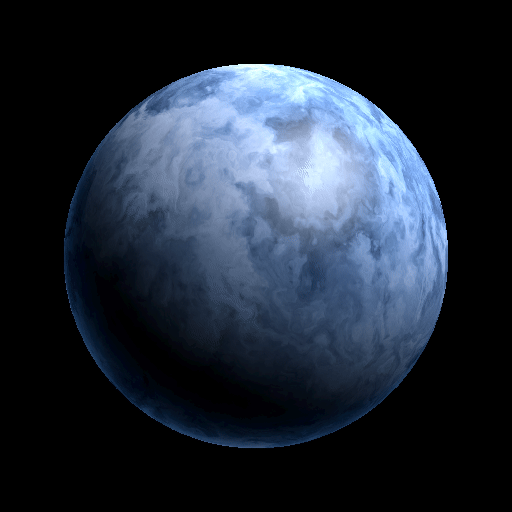

# Day 30: Final Project — Procedural Planet

## Overview

Final project of the 30-day shader challenge. Integrates Chapter 3 noise techniques with Chapter 4 3D lighting to produce a procedurally generated planet shader.

---

## Result



---

## Techniques

### Varying — passing local space position

For the surface pattern to rotate with the mesh, the noise must be sampled in **local space**, not world space. Applying `MODEL_MATRIX` fixes the pattern in world space, making it look like the mesh slides through a stationary texture.

```gdshader
varying vec3 local_pos;

void vertex() {
    local_pos = VERTEX; // local space, before MODEL_MATRIX
}
```

### FBM + Domain Warping (Chapter 3)

A `NoiseTexture3D` serves as the base hash for FBM. Domain warping runs in three stages (q → r → v), producing organic swirling cloud patterns that plain FBM cannot achieve.

```gdshader
float cloud(vec3 p, float time_scale, float warp) {
    vec3 q = vec3(fbm(p + vec3(TIME * time_scale * 2.0, ...)), ...);
    vec3 r = vec3(fbm(p + q + vec3(TIME * time_scale * 0.5, ...)), ...);
    return fbm(p + warp * r + vec3(0.0, 0.0, TIME * time_scale * 0.1));
}
```

Each stage uses a different TIME coefficient, so each layer drifts at a different speed.

### Multiple cloud layers

Two layers are sampled at different scales and speeds, then composited with the painter's algorithm — the outer layer overwrites the inner:

```gdshader
float v1 = cloud(p * 0.6,  0.01,  0.4); // outer — faster, finer detail
float v2 = cloud(p * 0.35, 0.004, 0.5); // inner — slower, larger scale

vec3 color = mix(color2, color1, smoothstep(0.1, 0.8, v1));
```

Scaling `p` down (`* 0.6`, `* 0.35`) makes the same noise pattern appear at a larger scale, giving each layer a distinct cloud size.

### Color mapping

FBM output is remapped to `[-1, 1]` then blended across three color bands (top/mid/bottom):

```gdshader
vec3 apply_color(float v, vec3 col_bot, vec3 col_mid, vec3 col_top) {
    float x = v * 2.0 - 1.0;
    vec3 color = mix(col_mid, col_top, clamp(x, 0.0, 1.0));
    return mix(color, col_bot, clamp(-x, 0.0, 1.0));
}
```

Without the `* 2.0 - 1.0` remap, FBM values cluster near 0.5 and the color range stays narrow.

### Lighting (Chapter 4)

```gdshader
void light() {
    // Sharp Lambert diffuse
    float ndotl = max(0.0, dot(NORMAL, LIGHT));
    DIFFUSE_LIGHT += pow(ndotl, 3.0) * LIGHT_COLOR;

    // Blinn-Phong specular
    vec3 h = normalize(LIGHT + VIEW);
    float spec = pow(max(0.0, dot(NORMAL, h)), specular_power);
    SPECULAR_LIGHT += spec * LIGHT_COLOR * specular_intensity;

    // Backlit rim — atmospheric glow on the shadow-side edge
    float backlight = 1.0 - max(0.0, dot(NORMAL, LIGHT));
    float rim = pow(1.0 - max(0.0, dot(NORMAL, VIEW)), rim_power);
    DIFFUSE_LIGHT += rim_color.rgb * backlight * rim * rim_intensity;
}
```

`render_mode ambient_light_disabled` removes ambient fill so the dark side is completely black, producing a dramatic day/night terminator.

---

## Parameters

| Parameter                     | Range     | Default    | Description                |
|-------------------------------|-----------|------------|----------------------------|
| **Color Bottom/Middle/Top 1** | Color     | Blue tones | Outer cloud color bands    |
| **Color Bottom/Middle/Top 2** | Color     | Dark blue  | Inner darkness color bands |
| **Specular Power**            | 1.0–128.0 | 32.0       | Highlight sharpness        |
| **Specular Intensity**        | 0.0–2.0   | 0.15       | Highlight brightness       |
| **Rim Power**                 | 0.1–8.0   | 6.0        | Rim falloff sharpness      |
| **Rim Intensity**             | 0.0–2.0   | 0.5        | Rim brightness             |
| **Rim Color**                 | Color     | Sky blue   | Backlit rim color          |
| **noise_texture**             | Texture3D | —          | NoiseTexture3D resource    |

---

## Usage

1. Open `planet.tscn` in Godot
2. Create a `NoiseTexture3D` resource and assign it to `noise_texture` — set FBM off, Domain Warping off, Value Noise, single octave
3. Add a `DirectionalLight3D` and adjust its angle to set the day/night composition
4. Adjust `RotationSpeed` in the C# wrapper to control auto-rotation speed

---

## Files

- `planet.gdshader` — Procedural planet shader
- `planet.tscn` — Scene with sphere mesh, camera, and directional light
- `Planet.cs` — C# wrapper with Y-axis auto-rotation via `GlobalRotateY()`
- `README.md` — This documentation
