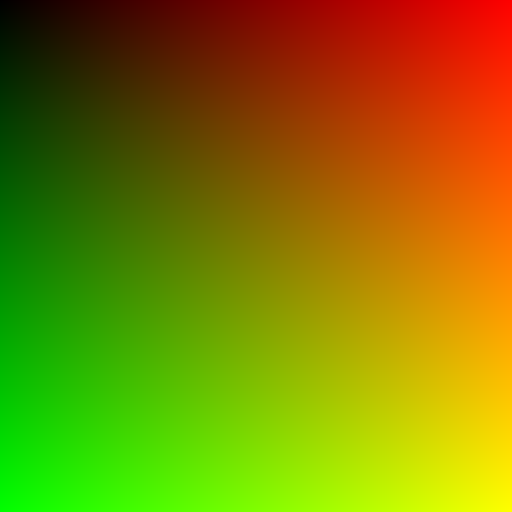
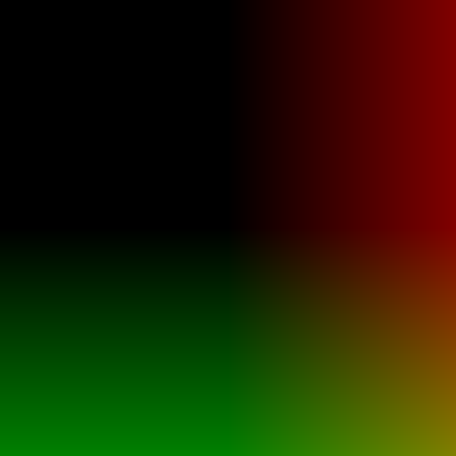

# Day 01: UV Basics & Visualization

## Overview

Understanding UV coordinates is fundamental to shader programming. UV coordinates are 2D coordinates that map positions on a texture or surface, typically ranging from (0,0) to (1,1).

## UV Coordinate System

```
(0,0) -------- U -------- (1,0)
  |                          |
  |                          |
  V         Surface          |
  |                          |
  |                          |
(0,1) -------------------- (1,1)
```

- **U axis**: Horizontal (left to right: 0 → 1)
- **V axis**: Vertical (top to bottom: 0 → 1)
- **Origin**: Top-left corner at (0, 0)
- **Range**: Both U and V go from 0.0 to 1.0

---

## Visualization Modes

### Mode 0: RGB Visualization

- **Red channel** = U coordinate (horizontal position)
- **Green channel** = V coordinate (vertical position)
- **Blue channel** = 0 (black)

**What to observe:**
- Top-left corner is black (U=0, V=0)
- Top-right corner is red (U=1, V=0)
- Bottom-left corner is green (U=0, V=1)
- Bottom-right corner is yellow (U=1, V=1, R+G=Yellow)

### Mode 1: Horizontal Gradient (U only)

Shows only the U coordinate as grayscale:
- Left edge: Black (U=0)
- Right edge: White (U=1)
- Smooth gradient in between

### Mode 2: Vertical Gradient (V only)

Shows only the V coordinate as grayscale:
- Top edge: Black (V=0)
- Bottom edge: White (V=1)
- Smooth gradient in between

### Mode 3: Centered UV

Shifts the origin from top-left to center by subtracting 0.5:
- Center of surface: (0, 0)
- Range: -0.5 to 0.5

**What to observe:**
- Negative values are clamped to 0 (black)
- Only the bottom-right quadrant shows color
- This demonstrates how color values outside 0-1 range are clamped

**Why it matters:**
Centering UV is essential for radial effects, rotations, and SDF shapes where calculations need to be relative to the center.

### Mode 4: Tiling

Multiplies UV by 4 and uses `fract()` to repeat the pattern:
- `fract()` returns the fractional part (0.0 to 1.0)
- Creates a 4×4 grid of the RGB visualization

**What to observe:**
- The same RGB gradient repeats in a grid
- Each tile is identical to Mode 0

**Why it matters:**
`fract()` is fundamental for creating repeating patterns, textures, and procedural effects.

### Mode 5: Radial

Calculates distance from center using `length()`:
- Center is brightest (distance ≈ 0)
- Corners are darkest (distance ≈ 0.707)

**What to observe:**
- Circular gradient emanating from center
- Perfect foundation for circular shapes and vignette effects

**Why it matters:**
Distance-based calculations are the basis of Signed Distance Functions (SDF), which we'll explore in Day 04.

---

## Key Concepts

### 1. The `UV` Built-in Variable
```gdshader
UV.x  // Horizontal position (0.0 to 1.0)
UV.y  // Vertical position (0.0 to 1.0)
```

### 2. Mapping Coordinates to Colors
```gdshader
vec3 color = vec3(UV.x, UV.y, 0.0);
```
This directly maps spatial coordinates to color channels.

### 3. Uniforms for Parameterization
```gdshader
uniform int mode : hint_enum(
    "RGB Visualization",
    "Horizontal Gradient (U Only)",
    "Vertical Gradient (V Only)",
    "Centered UV",
    "Tiling",
    "Radial"
) = 0;
```
Allows runtime control of shader behavior from the editor.

---

## Usage

1. Open `uv_visualization.tscn` in Godot
2. Select the ColorRect node
3. In the Inspector, modify shader parameters:
   - Change `mode` to see different visualizations

## Code Highlights

### Fragment Shader Structure
```gdshader
void fragment() {
    switch (mode) {
        case 0:
            COLOR = vec4(UV, 0.0, 1.0);
            break;

        case 1:
            COLOR = vec4(vec3(UV.x), 1.0);
            break;

        case 2:
            COLOR = vec4(vec3(UV.y), 1.0);
            break;

        case 3:
            COLOR = vec4(UV - vec2(0.5), 0.0, 1.0);
            break;

        case 4:
            COLOR = vec4(fract(UV * 4.0), 0.0, 1.0);
            break;

        case 5:
            float dist = length(UV - vec2(0.5));
            COLOR = vec4(vec3(dist), 1.0);
            break;
    }
}
```

## Files

- `uv_basics.gdshader` - The shader implementation
- `uv_visualization.tscn` - Test scene with ColorRect
- `README.md` - This documentation
